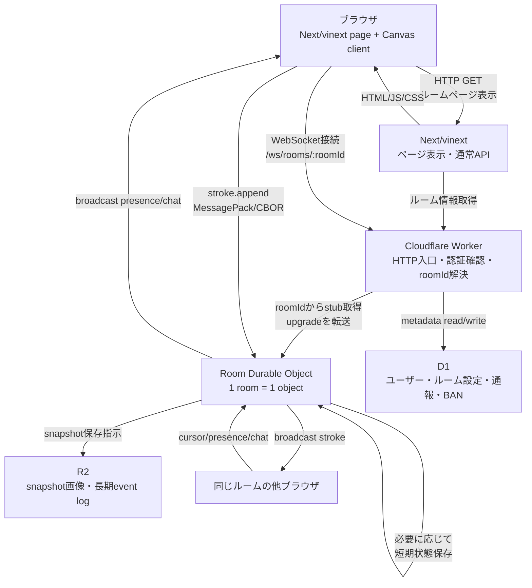

# お絵描きチャットサイトの技術スタック調査

調査日: 2026-06-27

## 結論

お絵描きチャットサイトの第一候補は、Cloudflare Workers + Durable Objects + R2 + D1 を中心にしたサーバーレス構成。

理由:

- ルーム単位のリアルタイム同期と相性がよい。Durable Object を 1 ルーム 1 インスタンスにすれば、同時編集の順序制御、参加者一覧、レイヤー/キャンバス状態の authoritative state をまとめやすい。
- WebSocket Hibernation を使うと、接続を維持したまま Durable Object を休眠でき、アイドル時間の duration 課金を避けられる。
- 2026 年時点では、Durable Objects は Workers Free でも利用でき、Free では SQLite storage backend のみ使える。MVP の検証は無料枠から始められる可能性がある。
- 本番相当の継続運用では、Workers Paid の追加枠、Cloudflare Email Service、監視、予備費を見ておくと安心。
- R2 はストレージのインターネット向け egress が無料なので、完成画像・サムネイル・添付画像の配信コストを読みやすい。

Liveblocks や tldraw sync は開発速度を上げる候補だが、MagicalDraw/pixivチャット型の「1 枚のキャンバスに線を描き込む」体験では、CRDT オブジェクト編集よりも、軽量な stroke/event 同期を自前で持つほうがコストと制御性のバランスがよい。

## 推奨構成

### フロントエンド

- React + Vite + TypeScript、または Next.js + vinext + TypeScript
- 描画: Canvas 2D から開始。大量レイヤー、拡大縮小、エフェクトが必要になったら WebGL/PixiJS を検討。
- ローカル状態: Zustand などの小さな state 管理。
- 通信: WebSocket。バイナリメッセージ推奨。
- 保存補助: IndexedDB に直近イベントと未送信 stroke を置き、再接続時に復帰しやすくする。

Next.js + vinext は構成として組み込める。特に、配信一覧、ルーム一覧、プロフィール、設定、管理画面、SEO が必要なページでは Vite SPA より扱いやすい。一方で、描画キャンバス本体は SSR/Server Components の利点がほぼないため、client component として明確に分離する。

Next.js + vinext を採用する場合の切り分け:

- Next/vinext: ページ、認証 UI、ルーム一覧、プロフィール、管理画面、静的 assets、通常の HTTP API。
- Durable Objects: 描画ルームの authoritative state、WebSocket、参加者、stroke 検証、presence、短期 event log。
- D1/R2: ルーム一覧やユーザーメタデータ、snapshot、長期保存。
- Canvas client: `use client` の描画専用コンポーネント。Next の router/rendering lifecycle に同期処理を巻き込まない。

避けるべきこと:

- Next route handler で描画ルームの WebSocket state を持つ。
- stroke event を Next Server Actions 経由で送る。
- 描画中の高頻度 state を React state だけで管理する。
- Canvas の全ピクセルを頻繁に API 送信する。

この分離を守れば、Next.js + vinext は邪魔にならない。むしろ、慣れている構成で認証・管理・ページ構造を作れるため、実装速度の面では有利。

### リアルタイム同期

- Cloudflare Workers
  - HTTP API、認証、WebSocket upgrade の入口。
- Cloudflare Durable Objects
  - `RoomObject` をルーム ID ごとに 1 つ作る。
  - 参加者、カーソル、キャンバス世代、未確定 stroke、チャット、レート制限を管理。
  - WebSocket Hibernation API を使う。
- プロトコル
  - stroke 開始/追加/終了、undo/redo、layer 操作、cursor/presence、chat、snapshot request を別 opcode にする。
  - pointermove をそのまま送らず、座標を一定間隔で間引き、複数点をまとめて 10-20Hz 程度で送る。
  - 座標はキャンバス基準の整数または fixed-point にして、JSON ではなく MessagePack/CBOR/独自 binary にする。

通信経路のイメージ:



処理の流れ:

1. ユーザーがルーム URL を開く。
2. Next/vinext がページを返す。ルーム名、説明、権限などの通常データは Worker/D1 から読む。
3. Canvas client が `/ws/rooms/:roomId` に WebSocket 接続する。
4. Worker が `roomId` に対応する `Room Durable Object` を取得し、WebSocket upgrade を渡す。
5. ユーザーが線を引くと、ブラウザは点列を `stroke.append` として MessagePack/CBOR で送る。
6. Room Durable Object が stroke を検証し、`roomSeq` を付ける。
7. Room Durable Object が同じルームの参加者全員へ同じ stroke を同じ順序で broadcast する。
8. 一定数の stroke または一定時間ごとに、snapshot や長期 event log を R2 に保存する。
9. 再接続したユーザーには、最新 snapshot + それ以後の event を返して復帰させる。

#### stroke event のバイナリ形式候補

独自 binary を最初から設計しきらない場合は、次の順で検討する。

| 形式 | 向き | 利点 | 注意点 |
| --- | --- | --- | --- |
| MessagePack | 第一候補 | JSON に近いデータ構造を小さく送れる。JavaScript 実装が多く、デバッグしやすい。 | schema がないため、バージョン管理は自前ルールが必要。 |
| CBOR | 第一候補に近い | 標準仕様があり、Map/Array/整数/バイナリを自然に扱える。ブラウザ/Workers でも扱いやすい。 | MessagePack より周辺ライブラリ選定を少し慎重に見る。 |
| Protocol Buffers | 厳格な schema が欲しい場合 | schema と後方互換ルールを持てる。多言語化やログ解析に強い。 | 小さな高頻度 message では protobuf runtime/schema 管理がやや重い。 |
| FlatBuffers | zero-copy や大型データ向け | 大きめの構造化データを効率よく読む用途に強い。 | stroke の小粒 message には複雑すぎる可能性が高い。 |
| BSON | MongoDB 系と連携する場合 | 型付き document として扱える。 | stroke event にはやや大きくなりやすく、今回の第一候補ではない。 |

MVP では MessagePack か CBOR が現実的。どちらも `ArrayBuffer` として WebSocket 送信でき、デバッグ時には JSON へ変換してログ出力しやすい。

stroke message の例:

```ts
type StrokeAppend = {
  op: "stroke.append";
  roomSeq: number;
  strokeId: string;
  layerId: string;
  color: number;
  brushSize: number;
  points: Array<[x: number, y: number, pressure: number, dt: number]>;
};
```

実装では文字列キーをそのまま送ると大きくなるため、送信時は opcode と field id に変換する。

```txt
[op=2, roomSeq, strokeId, layerId, color, brushSize, points]
```

最初は MessagePack/CBOR で始め、負荷試験で message size や CPU が問題になった時点で独自 binary に寄せるのがよい。

### 永続化

- Durable Objects SQLite
  - ルームの小さなメタデータ、現在のイベントログ位置、短期の差分ログ。
- Cloudflare R2
  - 定期 snapshot PNG/WebP、サムネイル、添付画像、長期保存するイベントログ。
- Cloudflare D1
  - ユーザー、ルーム一覧、公開設定、通報、BAN、運営用検索。

### 認証・メール・管理者限定ページ

将来的にユーザーログインが必要になった場合は、Better Auth + Google/GitHub OAuth + メール認証を第一候補にする。`gamine-next` でも採用経験があり、Next.js + vinext 構成との相性もよい。

採用方針:

- 認証ライブラリ: Better Auth
- OAuth: Google / GitHub
- メール認証: Cloudflare Email Service を第一候補、Resend を代替候補
- セッション/ユーザー: D1 に保存
- 管理者権限: D1 の user role / allowlist で管理

Cloudflare Email Service を第一候補にする理由:

- 本番運用やメール認証のために Workers Paid へ上げる場合、追加サービスを増やさずに済む。
- Workers Paid では Email Sending が月 3,000 通 included、超過は $0.35/1,000 通。
- Email Routing は Free/Paid どちらでも使える。
- Workers binding で送れるため、Next/vinext 側の API route から Workers 経由で安全に扱いやすい。

Resend を候補に残す理由:

- 導入経験がある。
- Free は 3,000 emails/月、100 emails/day、1 domain。
- Pro は $20/月で 50,000 emails/月、超過 $0.90/1,000 emails。
- React Email や webhook、管理画面の体験がよく、Cloudflare Email Service が beta で不安な場合のフォールバックにしやすい。

開発中や匿名公開期間に管理者だけが入れるページを作る場合は、アプリ内ログインを急いで作らず、Cloudflare Access を使うのがよい。Cloudflare Access は Free Plan が $0 で、50 user limit の範囲なら管理画面やプレビュー環境の保護に十分。Cloudflare Access の OTP/IdP と Email Routing を組み合わせれば、アプリ本体の認証実装前でも `/admin` や preview URL を安全に閉じられる。

段階的な導入案:

1. 開発中: Cloudflare Access で `/admin/*` と preview を保護。アプリ内ユーザーは匿名。
2. クローズド公開: 管理者だけ Access、一般ユーザーは匿名 + room token。
3. ユーザー機能追加: Better Auth + Google/GitHub OAuth を導入。
4. メール認証追加: Cloudflare Email Service を使う。到達性や運用で詰まる場合は Resend に切り替え可能にする。
5. 本公開: D1 上の role/ban/allowlist と Better Auth session を管理画面に統合する。

注意点:

- Cloudflare Access は管理者・開発者向けの入口保護として使い、一般ユーザーのサービス内アカウント機能とは分ける。
- メール認証は transactional email なので Cloudflare Email Service / Resend の用途に合う。ニュースレターや一斉告知は別途配信基盤を検討する。
- 管理画面の保護は二重化してよい。Cloudflare Access で入口を閉じ、アプリ内でも admin role を確認する。

## 代替案

### tldraw sync

tldraw は Cloudflare template を推奨しており、Durable Objects を「部屋ごとの WebSocket server」、R2 を画像/動画などの large binary assets に使う構成が公式に示されている。自前でホワイトボード型 UI を作りたい場合は強い候補。

ただし、お絵描きチャットではブラシ、筆圧、レイヤー、キャンバスのラスタ合成が中心になる。図形/ドキュメント同期寄りの tldraw をそのまま採用すると、UI とデータモデルを寄せる必要が出る。MVP では参考実装として見るに留めるのが現実的。

### Yjs / y-websocket

Yjs の y-websocket は、クライアントが 1 endpoint に接続し、サーバーが document update と awareness を配る中央集権型モデルを提供する。認証や認可を既存 cookie/header に寄せやすい。

キャンバス全体を CRDT document として持つ場合には便利。ただし、筆跡のような大量・一方向・追記型イベントには CRDT の汎用性が過剰になりやすい。レイヤーやオブジェクト編集を主機能にする場合だけ採用候補。

### Liveblocks

導入が速く、presence、cursor、storage、undo/redo、offline support が揃う。プロトタイプや共同編集 SaaS には向く。

一方、料金が realtime collaboration minutes に比例する。公開お絵描きチャットのように「見ているだけの人」も長時間接続するサービスでは、Cloudflare 自前同期より高くなりやすい。

### VPS / Node.js / Socket.IO

小規模なら $5-20/月程度の VPS と Node.js WebSocket でも動く。単一プロセスで始めると実装は簡単。

ただし、ルーム分散、再起動時の復旧、DDoS/帯域、ログ、バックアップ、スケールアウトを自前で抱える。個人開発の初期検証以外では、Cloudflare のほうが運用負担が軽い。

## コスト試算

価格は 2026-06-27 時点の公式ページ確認ベース。

### Cloudflare 前提価格

- Workers Free: Durable Objects を利用可能。ただし Free plan では Durable Objects の SQLite storage backend のみ利用できる。MVP 検証は Free から始められる。
- Workers Paid: 最低 $5/月。Workers、Pages Functions、KV、Hyperdrive、Durable Objects usage を含む。追加 egress/throughput 課金なし。
- Workers Standard: 1,000 万 request/月 included、追加 $0.30/100 万 request。WebSocket 接続は初回 upgrade が request として数えられ、Worker 経由の WebSocket message は request に数えられない。
- Durable Objects: 100 万 request/月 included、追加 $0.15/100 万 request。WebSocket の outgoing message は無料。incoming WebSocket message は課金上 20:1 に圧縮され、100 incoming messages が 5 requests 相当。
- Durable Objects duration: 40 万 GB-s/月 included、追加 $12.50/100 万 GB-s。通常 `accept()` で WebSocket を保持すると接続中ずっと duration が発生するため、Hibernation API を使う前提にする。
- D1: rows read 250 億/月 included、rows written 5,000 万/月 included、storage 5GB included。
- R2: Free 枠は 10GB-month、Class A 100 万 request/月、Class B 1,000 万 request/月。標準 storage は $0.015/GB-month、Class A $4.50/100 万、Class B $0.36/100 万、egress 無料。

### 通信量の目安

動画配信と違い、全画面フレームを送り続けない。基本は stroke event を送る。

仮定:

- 描画中 1 ユーザーあたり 10 messages/sec にバッチ。
- 1 message は複数点入りで 100-400 bytes 程度を目標。
- 1 描画ユーザー分の 1 分間 = 600 incoming messages。
- Durable Objects 課金上は 600 / 20 = 30 requests 相当。

つまり、`描画ユーザー分数 x 30` が Durable Objects request の概算になる。接続数そのものより、「実際に線を引いている時間」が主な変動要因。

### 規模別の月額目安

| 規模 | 仮定 | Cloudflare 月額目安 | コメント |
| --- | --- | ---: | --- |
| 開発/クローズドα | 100 MAU、同時 5-10、描画 5,000 分/月、保存 1GB 未満 | $0-5 | Durable Objects は Free でも試せる。メール認証や本番予備費を見始めたら Workers Paid $5 を検討。 |
| 小規模公開 | 1,000 MAU、同時 20-50、描画 50,000 分/月、保存 10GB 未満 | $5-8 | DO request は 150 万相当。超過は小さい。R2 も無料枠付近。 |
| 中規模コミュニティ | 10,000 MAU、同時 100-300、描画 300,000 分/月、保存 100GB | $10-30 | DO request は 900 万相当で追加 $1-2 程度。R2 保存 100GB でも約 $1.50/月。実際はログ、画像処理、Bot 対策が追加要因。 |
| 大規模/常時多数ルーム | 同時 1,000+、複数ルームが常時描画 | $50+ | duration、ログ、レート制限、監視、モデレーション、画像処理が支配的になる。負荷試験前提。 |

この表では、独自 binary protocol と WebSocket Hibernation を使う前提。JSON で高頻度送信したり、通常 WebSocket API で接続中ずっと Durable Object を起こし続ける設計にすると、duration 課金と帯域が大きく増える。

## 小規模コミュニティ想定の比較

ここでは小規模コミュニティを次の条件で固定する。

- 1,000 MAU
- ピーク同時接続 20-50
- 常時アクティブなルーム 1-5
- 描画ユーザー時間 50,000 分/月
- 接続ユーザー時間 100,000 分/月
- snapshot/添付/ログ保存 10GB
- 配信 traffic 100-500GB/月

### 月額比較

| 構成 | 月額目安 | 向いている状況 | 注意点 |
| --- | ---: | --- | --- |
| Cloudflare 自前同期 | $5-8 | 長く運用する本命。WebSocket 接続が多くても、描画 event だけを送れば安い。 | Durable Objects の設計と binary protocol は自前実装が必要。 |
| Liveblocks | $170 前後 | 最速で共同編集機能を試したいプロトタイプ。 | 100,000 connected user-minutes/月 x $0.002 = $200 相当。Pro の monthly credits を差し引いても高い。room 同時接続上限も確認が必要。 |
| VPS 1 台構成 | $10-25 | 最初の個人運用。Node.js/Go/Rust WebSocket server + SQLite/Postgres を同居。 | 安いが、バックアップ、監視、再起動、DDoS/帯域、OS 更新、障害復旧を自分で見る。 |
| VPS + managed DB/backup | $30-70 | DB 消失や単一障害を少し避けたい小規模本番。 | Cloudflare 自前構成より高くなりやすい。リアルタイム server の単一障害は残る。 |
| VPS 冗長構成 | $60-150+ | 複数台、Redis Pub/Sub、Load Balancer、DB 分離を置く場合。 | ルームの順序制御と sticky routing が必要。小規模段階では過剰。 |

### Cloudflare 自前同期の内訳

| 項目 | 試算 | 金額 |
| --- | --- | ---: |
| Workers | Free から開始可能。本番では Paid $5 を予備費込みで見込む | $0-5 |
| Durable Objects requests | 50,000 描画分 x 30 requests = 150 万 requests 相当。100 万 included 後の 50 万 x $0.15/100 万 | 約 $0.08 |
| Durable Objects duration | WebSocket Hibernation 前提。アイドル接続は duration をほぼ増やさない | $0-数ドル |
| D1 | 小規模の room/user/通報程度なら included 内 | $0 |
| R2 storage | 10GB included 内 | $0 |
| R2 requests | snapshot と画像配信が極端でなければ included 内 | $0 |
| 合計 | ドメイン代を除く | $5-8 |

この条件では、Cloudflare の追加課金はほぼ Durable Objects の incoming message と duration だけになる。outgoing WebSocket message が無料なのが大きい。

### Liveblocks の内訳

| 項目 | 試算 | 金額 |
| --- | --- | ---: |
| Realtime collaboration minutes | 100,000 connected user-minutes x $0.002/min | $200 |
| Pro monthly credits | Pro の credits を差し引く前提 | -$30 程度 |
| 合計 | 価格体系上の概算 | $170 前後 |

Liveblocks は「描いた時間」ではなく「接続して共同作業している時間」で増えやすい。お絵描きチャットは閲覧・待機ユーザーも長く接続しがちなので、公開コミュニティ運用では割高になりやすい。

### VPS の試算

VPS では、1 台に WebSocket server、HTTP API、DB、snapshot worker、静的ファイル配信を同居させる前提。

| VPS 案 | 例 | 月額目安 | コメント |
| --- | --- | ---: | --- |
| 最小構成 | 1 vCPU / 1GB RAM / 25GB SSD。Akamai Nanode 1GB は $5/月、1TB transfer 例。 | $5-10 | 検証用。ピーク 50 接続と画像処理を載せるにはメモリが心許ない。 |
| 現実的な単一台 | 2 vCPU / 2-4GB RAM / 50-80GB SSD | $10-25 | 小規模公開の下限。DB と WebSocket を同居し、Cloudflare CDN を前段に置く。 |
| 余裕を見る単一台 | 4 vCPU / 8GB RAM / 100GB+ SSD。Akamai Linode 8GB は $48/月、5TB transfer 例。 | $40-60 | snapshot 合成、ログ、Bot 対策、管理画面まで同居しやすい。 |
| 単一台 + 外部バックアップ | 上記 + backup/snapshot/object storage | +$5-20 | 本番では最低限必要。VPS 本体障害や操作ミスに備える。 |
| 単一台 + managed DB | VPS + managed PostgreSQL/MySQL | +$15-50 | DB 運用を軽くできるが、低コストの利点は薄れる。 |

VPS は月額だけなら Cloudflare と同等か少し高い程度に見える。ただし、実運用コストは「人間の運用時間」と「障害時の復旧難度」が乗る。

VPS で安く始めるなら次の構成が現実的。

- 2 vCPU / 2-4GB RAM VPS
- Caddy または nginx
- Node.js/ws、Go、Rust のいずれかで WebSocket server
- SQLite から開始。room/user/通報が増えたら Postgres。
- 画像と snapshot はローカル保存ではなく、R2 などの object storage へ逃がす。
- Cloudflare CDN/WAF を前段に置き、HTTP assets はキャッシュする。
- 毎日 DB backup、R2/object storage への退避、systemd restart、監視通知を入れる。

### 小規模コミュニティでの判断

月額だけを見ると、VPS は $10-25 で十分始められる。だが、お絵描きチャットは WebSocket、荒らし対策、snapshot、障害復旧が絡むため、運用を軽くしたいなら Cloudflare 自前同期の $5-8 が最も扱いやすい。

Liveblocks は初期開発の速さが最大の利点だが、今回のような公開チャットでは接続分数課金が支配的になる。小規模でも $100/月を超えやすく、長期運用の第一候補にはしにくい。

Cloudflare/Liveblocks/VPS の 3 案だけで比べた場合の推奨順位:

1. Cloudflare Workers + Durable Objects + R2 + D1
2. VPS 単一台 + R2/object storage
3. Liveblocks
4. VPS 冗長構成

## その他の選択肢

Cloudflare 自前構成、Liveblocks、VPS 以外にも、リアルタイム基盤を外部化する候補はある。ただし、お絵描きチャットは fan-out が大きい。描画者 1 人の stroke message が、同じルームの閲覧者全員へ配信されるため、マネージド pub/sub では「送信数 x 参加者数」が料金に効きやすい。

ここでも小規模コミュニティ条件は次のまま使う。

- 1,000 MAU
- ピーク同時接続 20-50
- 描画ユーザー時間 50,000 分/月
- 接続ユーザー時間 100,000 分/月
- 保存 10GB
- 配信 traffic 100-500GB/月

メッセージ数は、実装次第でかなり変わる。

- 楽観ケース: ルーム単位で差分をまとめ、受信側 2-5 messages/sec 程度まで落とす。
- 通常ケース: 描画中 10 messages/sec、閲覧者にも 10 messages/sec 程度で配る。
- 通常ケースの概算: 100,000 connected user-minutes x 600 messages/min = 6,000 万 outbound messages/月。incoming 3,000 万 messages/月を足すと、約 9,000 万 messages/月。

### 追加候補の月額比較

| 構成 | 月額目安 | 向いている状況 | 注意点 |
| --- | ---: | --- | --- |
| Supabase Realtime + Postgres + Storage | $25-250+ | 認証、DB、管理画面、REST/RPC をまとめたい場合。 | Realtime は Pro で 500 peak connections / 500 messages/sec。message 超過は $2.50/100 万。stroke fan-out が多いと高くなる。 |
| Firebase Realtime Database / Firestore | $100-500+ | Firebase Auth、Hosting、モバイル SDK を重視する場合。 | ダウンロード量課金が重い。canvas 差分配信を DB 更新として扱うと読み取り/egress が増えやすい。 |
| Ably | $50-300+ | グローバル edge pub/sub、presence、接続管理を外部化したい場合。 | Standard は $29/月 + usage。messages は $2.50/100 万、connection/channel minutes も課金。fan-out で message 数が増える。 |
| Pusher Channels | $49-299 | シンプルな WebSocket pub/sub を早く使いたい場合。 | Startup $49 は 100 万 messages/day、500 concurrent connections。通常ケース 300 万 messages/day 前後なら Pro $99 以上を見込む。 |
| PubNub | $98-190+ | MAU ベースで読みやすい料金、presence/履歴/管理機能を重視する場合。 | Starter $98 は 1,000 MAU included。公開コミュニティでは Cloudflare よりかなり高い。 |
| AWS AppSync Events / GraphQL subscriptions | $100-200+ | AWS に寄せる、Cognito/S3/DynamoDB/Lambda と統合したい場合。 | Event API は inbound/outbound/WebSocket 操作が $1/100 万、接続分は安いが fan-out message と AWS 周辺サービス費が乗る。 |
| Convex | $30-100+ | アプリ状態と DB をリアクティブに作りたい場合。 | お絵描き stroke の高頻度 fan-out には料金・モデルの相性確認が必要。egress が $0.132/GB 付近なので画像/差分配信量が効く。 |
| Railway / Render / Fly.io などの PaaS | $20-80 | VPS より運用を軽くし、自前 WebSocket server を動かしたい場合。 | VPS より楽だが、常時稼働 compute、volume、egress、DB で Cloudflare より高くなりやすい。 |
| PartyKit | Cloudflare 構成に近い | Durable Objects ベースの room server を書きやすくしたい場合。 | 実質 Cloudflare Workers/Durable Objects 系の選択肢。長期運用では underlying Cloudflare 設計を理解する必要がある。 |

### 通常ケースの日本円比較

換算レートは 2026-06-27 時点の概算として `1 USD = 162 円` を使う。為替、税、決済手数料、ドメイン代は別。

| 順位 | 構成 | USD/月 | 円/月の概算 | 評価 |
| ---: | --- | ---: | ---: | --- |
| 1 | Cloudflare Workers + Durable Objects + R2 + D1 | $5-8 | 約 810-1,300 円 | 最有力。低コストで運用負担も軽い。 |
| 2 | PartyKit / Durable Objects 系 | $5-15 程度 | 約 810-2,400 円 | Cloudflare 構成を少し書きやすくする候補。基盤理解は必要。 |
| 3 | VPS 単一台 + R2/object storage | $10-25 | 約 1,600-4,100 円 | 月額は安い。運用と障害対応を自分で見る必要がある。 |
| 4 | PaaS 自前 WebSocket + object storage | $20-80 | 約 3,200-13,000 円 | VPS より楽。Cloudflare よりは高くなりやすい。 |
| 5 | VPS + managed DB/backup | $30-70 | 約 4,900-11,300 円 | VPS 本番運用の現実的な強化案。 |
| 6 | Supabase Realtime | $25-250+ | 約 4,100-40,500 円+ | 楽観ケースなら安いが、通常ケースの fan-out では高くなる。 |
| 7 | Pusher Channels | $99 前後 | 約 16,000 円 | 通常ケースなら Pro 目安。実装は簡単。 |
| 8 | Convex | $30-100+ | 約 4,900-16,200 円+ | アプリ基盤には便利。stroke 同期本線は要検証。 |
| 9 | VPS 冗長構成 | $60-150+ | 約 9,700-24,300 円+ | 小規模では過剰。複雑さが増える。 |
| 10 | PubNub | $98-190+ | 約 15,900-30,800 円+ | MAU ベースで読みやすいが高め。 |
| 11 | AWS AppSync | $100-200+ | 約 16,200-32,400 円+ | AWS 統一なら候補。周辺サービス込みで重い。 |
| 12 | Ably | $50-300+ | 約 8,100-48,600 円+ | グローバル pub/sub は強いが message 課金が効く。 |
| 13 | Liveblocks | $170 前後 | 約 27,500 円 | 共同編集プロトタイプ向き。公開お絵描きチャットでは割高。 |
| 14 | Firebase Realtime Database / Firestore | $100-500+ | 約 16,200-81,000 円+ | Auth 等は強いが、差分配信を DB に載せると高い。 |

通常ケースの総括:

- 低コストかつ運用負担を抑えるなら、Cloudflare 自前構成が最も良い。
- 月額だけを最小化するなら VPS 単一台も候補だが、バックアップ、監視、OS 更新、障害復旧の手間が乗る。
- Supabase、Firebase、Ably、Pusher、PubNub は realtime 基盤を外部化できるが、stroke fan-out によって料金が伸びやすい。
- Liveblocks は UI/共同編集機能の検証速度に価値があるが、接続分数課金のため本番の第一候補にはしにくい。

## 支援金で賄う場合の損益分岐

小規模コミュニティを支援金で運営するなら、技術構成は Cloudflare 自前構成を前提にするのが最も現実的。ここでは人件費、開発端末、デザイン外注、法務/会計顧問、広告費は含めず、「サービスを閉じずに維持するための最低限」に絞る。

決済手数料は、Stripe 直決済なら日本国内カードで 3.6%。Patreon は creator income の 10% に加えて payment processing、currency conversion、payout fees、税がある。日本の小規模サービスで手取りを見積もるなら、Stripe 直は 4% 前後、Patreon/外部支援サービスは 12-15% 前後を見ておく。

### 必要最低限の月額コスト

| 項目 | 月額目安 | 内容 |
| --- | ---: | --- |
| Cloudflare Workers + Durable Objects + R2 + D1 | 1,000-1,500 円 | 通常ケースの本体サーバー代。 |
| ドメイン | 150-300 円 | 年 2,000-4,000 円程度を月割り。 |
| メール送信/通知 | 0-1,000 円 | 初期は無料枠でよい。認証メール、通報通知、運営通知。 |
| 監視/ログ/エラー通知 | 0-1,000 円 | 初期は無料枠中心。必要に応じて UptimeRobot/Sentry 等。 |
| バックアップ/予備ストレージ | 0-500 円 | R2/D1 export、重要ログの退避。 |
| 決済・会計まわりの雑費 | 0-500 円 | 振込、為替、帳簿用ツール等の最低限。 |
| 予備費 | 1,000-3,000 円 | スパイク、Bot、保存増、検証用リソース。 |
| 合計 | 2,000-7,800 円 | 最低ラインは 2,000-3,000 円、現実ラインは 5,000-8,000 円。 |

### 必要な支援金総額

| 運営ライン | 月の固定費想定 | Stripe 直決済で必要な支援総額 | Patreon/外部支援サービスで必要な支援総額 | 判断 |
| --- | ---: | ---: | ---: | --- |
| 最低維持 | 3,000 円 | 約 3,200 円 | 約 3,500 円 | かなり切り詰めた赤字回避ライン。 |
| 現実的な最低 | 5,000 円 | 約 5,200 円 | 約 5,900 円 | 小規模公開でまず目標にするライン。 |
| 安定運用 | 10,000 円 | 約 10,400 円 | 約 11,800 円 | 突発的な増加や有料監視を吸収しやすい。 |
| 余裕あり | 30,000 円 | 約 31,200 円 | 約 35,300 円 | 機能検証、外部サービス、有料ツールを試せる。 |

結論として、Cloudflare 自前構成なら、月 5,000 円の支援金が集まれば赤字回避は現実的。月 10,000 円あれば、通常の小規模コミュニティ運営ではかなり安心。VPS 構成なら月 10,000 円を最低目標、PaaS や Supabase などを使うなら月 20,000-50,000 円以上を見たほうがよい。

### 支援者数で見た目安

| 月額支援単価 | 5,000 円を集める人数 | 10,000 円を集める人数 | 30,000 円を集める人数 |
| ---: | ---: | ---: | ---: |
| 300 円 | 17 人 | 34 人 | 100 人 |
| 500 円 | 10 人 | 20 人 | 60 人 |
| 1,000 円 | 5 人 | 10 人 | 30 人 |
| 3,000 円 | 2 人 | 4 人 | 10 人 |

小規模コミュニティでは、「月 300-500 円の任意支援 + 少人数の高額スポンサー」を組み合わせるのが現実的。例えば 500 円支援が 10 人いれば最低ライン、500 円支援が 20 人いれば安定運用ラインに届く。

### FANBOX 300 円プランの場合

FANBOX の手数料は、全年齢設定なら支援額の 10%、R-18 コンテンツ設定なら 12.9%。銀行振込は、3 万円未満の振込で 200 円、3 万円以上で 300 円の振込手数料がかかる。PayPal 受け取りなら FANBOX 側の振込手数料はない。

300 円プランの手取り目安:

- 全年齢設定: 300 円 - 10% = 270 円/人
- R-18 設定: 300 円 - 12.9% = 約 262 円/人

PayPal 受け取りまたは振込手数料を無視した場合:

| 運営ライン | 必要な手取り | 全年齢設定 | R-18 設定 |
| --- | ---: | ---: | ---: |
| 最低維持 | 3,000 円 | 12 人 | 12 人 |
| 現実的な最低 | 5,000 円 | 19 人 | 20 人 |
| 安定運用 | 10,000 円 | 38 人 | 39 人 |
| 余裕あり | 30,000 円 | 112 人 | 115 人 |

銀行振込手数料まで含める場合:

| 運営ライン | 必要な手取り + 振込手数料 | 全年齢設定 | R-18 設定 |
| --- | ---: | ---: | ---: |
| 最低維持 | 3,200 円 | 12 人 | 13 人 |
| 現実的な最低 | 5,200 円 | 20 人 | 20 人 |
| 安定運用 | 10,200 円 | 38 人 | 39 人 |
| 余裕あり | 30,300 円 | 113 人 | 116 人 |

FANBOX の自動振込は、振込可能額が 5,000 円未満の場合は翌月以降へ繰り越される。そのため、実務上は最低維持ラインの 3,000 円では毎月入金されない可能性がある。月次で安定して受け取りたいなら、300 円プランでは全年齢設定で 19-20 人、R-18 設定で 20 人以上を最低目標にするのが現実的。

### 支援金モデルの推奨

- まず月 5,000 円を公開目標にする。文言は「サーバー・ドメイン・監視・バックアップ維持費」。
- 次の目標を月 10,000 円にする。文言は「混雑時の余裕、保存容量、監視強化」。
- 決済は初期は GitHub Sponsors、OFUSE、Stripe Payment Links、Ko-fi など低実装コストのものを外部リンクで置く。
- サイト内に支援機能を組み込むのは後回し。決済、領収、返金、税務、規約対応の実装負担が増える。
- 支援者特典は、機能差ではなくクレジット表示、支援者バッジ、開発ログ閲覧程度に留める。描画機能の優遇はコミュニティ体験を壊しやすい。

### Supabase Realtime

Supabase は Pro が $25/月からで、Realtime は Pro で 500 concurrent connections、500 messages/sec、5 million messages included。超過は $2.50/100 万 messages、peak connections は 500 included 以後 $10/1,000 peak connections。

小規模条件では peak 20-50 なので接続数は問題ない。一方で通常ケース 9,000 万 messages/月だと、5 million included を超えた 8,500 万 x $2.50/100 万 = $212.50。Pro 基本料を足して $237.50 前後になる。

楽観ケースで 1,000-2,000 万 messages/月まで落とせるなら $37.50-62.50 前後。DB/Auth/Storage を含めて開発速度は高いが、stroke fan-out を Supabase Realtime に直接流す設計は高くなりやすい。

### Firebase

Firebase Realtime Database は Spark/Blaze で 100/200K connections、1GB stored included、download は 10GB/月 included 後 $1/GB、storage は $5/GB。Firestore は reads/writes/deletes と egress が課金軸。

小規模条件で差分配信 traffic が 100-500GB/月あると、Realtime Database の download だけで約 $90-490。保存 10GB なら included 後 9GB x $5 = $45。合計は $135-535 前後になりやすい。

Firebase は認証とモバイル開発には強いが、リアルタイム canvas の高頻度更新を DB に載せる構成は高く、データモデルも窮屈。採用するなら、チャット/プロフィール/Auth だけ Firebase に置き、stroke 同期は別基盤に分けるほうがよい。

### Ably / Pusher / PubNub

この系統は「WebSocket fan-out を自分で運用しない」ための選択肢。

Ably:

- Free は 200 concurrent connections、6M messages/月。
- Standard は $29/月 + usage。
- messages は $2.50/100 万、connection minutes と channel minutes は各 $1/100 万 minutes。
- 小規模条件の 9,000 万 messages/月なら、message usage だけで約 $225。Standard 基本料込みで $250 前後。

Pusher Channels:

- Sandbox は free、200K messages/day、100 concurrent connections。
- Startup は $49/月、1M messages/day、500 concurrent connections。
- Pro は $99/月、4M messages/day、2,000 concurrent connections。
- 小規模条件の 9,000 万 messages/月は平均 3M/day なので、Pro $99/月が目安。

PubNub:

- Free は 200 MAU または 1M transactions。
- Starter は $98/月で 1,000 MAU included。
- 価格例では 1,000 MAU の Platform Pro が $190/月。
- MAU 課金で読みやすいが、Cloudflare 自前同期や VPS と比べると高い。

この系統は、描画イベント数をかなり抑えられるなら検討できる。逆に、ブラシをリアルタイムに滑らかに見せる設計では message 課金が支配的になる。

### AWS AppSync

AppSync GraphQL realtime は $2/100 万 real-time updates、$0.08/100 万 connection-minutes。AppSync Events は inbound/outbound/WebSocket 操作が $1/100 万 operations、connection-minutes は同じ $0.08/100 万。

通常ケース 9,000 万 operations/月なら、AppSync Events 部分だけで約 $90。接続分は 100,000 minutes x $0.08/100 万 = $0.008 とほぼ無視できる。ここに Lambda、DynamoDB/RDS、S3、CloudFront、ログ、data transfer が乗るため、全体では $100-200+ を見る。

AWS に統一する理由があるなら候補。ただし、お絵描きチャットだけなら Cloudflare より設計・運用が重い。

### Convex

Convex はリアクティブ DB と functions をまとめられる。Professional は $25/developer/month。Starter は pay-as-you-go で、function calls、storage、database I/O、data egress が課金される。egress は Free/Starter で 1GB included 後 $0.132/GB、Professional は 50GB included 後 $0.12/GB。

配信 traffic 100-500GB/月だと egress だけで $6-60 程度。DB I/O や function calls は実装次第。お絵描きチャットの stroke fan-out を Convex のリアクティブ query にそのまま載せるのは要検証で、採用候補としては「チャット/ルーム状態/管理画面は Convex、stroke 同期は別」の分離案が現実的。

### PaaS: Railway / Render / Fly.io

Railway は Hobby が $5 minimum、Pro が $20 minimum で、CPU/RAM/volume/egress は従量。egress は services で $0.05/GB、object storage は $0.015/GB-month かつ egress free。

PaaS は VPS よりデプロイ、ログ、再起動、環境変数、DB 追加が楽。だが WebSocket server は基本的に自前で、常時稼働 compute と egress が発生する。小規模なら $20-80/月程度を見込む。VPS より運用は軽いが、Cloudflare 自前構成ほど安くはない。

### 全候補を含めた推奨順位

1. Cloudflare Workers + Durable Objects + R2 + D1
2. VPS 単一台 + R2/object storage
3. PaaS 上の自前 WebSocket server + object storage
4. Pusher Channels
5. Supabase Realtime
6. Ably
7. PubNub
8. AWS AppSync
9. Convex
10. Firebase Realtime Database / Firestore
11. Liveblocks

Liveblocks はお絵描きチャット用途では高めだが、共同編集 UI を高速に検証する目的なら別枠で有用。Firebase/Convex/Supabase はアプリ基盤としては強いが、stroke 同期の本線に使う場合は fan-out 課金と高頻度更新の相性を厳しく見る必要がある。

### Liveblocks での概算

Liveblocks は Free が 3,000 realtime collaboration minutes included、Pro が $25/月 billed annually で $30 monthly credits included、realtime collaboration minutes は $0.002/min。Simultaneous connections per room は Free 10、Pro 20、Team 50、Enterprise 100。

例:

- 50,000 connected user-minutes/月: 50,000 x $0.002 = $100 相当。Pro の $30 credits を差し引いても、Cloudflare 自前同期より高くなりやすい。
- 300,000 connected user-minutes/月: $600 相当。Team 以上の検討領域。

Liveblocks は「導入速度にお金を払う」選択肢。公開お絵描きチャットの本番基盤としては、接続時間課金が重くなりやすい。

## MVP の設計方針

MVP の目的は、「不特定多数が同じキャンバスに入り、ほぼリアルタイムに線を描ける」ことを最小構成で検証すること。最初から MagicalDraw/Magma 相当の高機能ツールを目指さず、同期・荒らし耐性・保存復帰の土台を先に固める。

### MVP で作るもの

| 領域 | MVP の範囲 |
| --- | --- |
| ルーム | 公開ルームを作成、ルーム URL で入室、ルーム名/説明/キャンバスサイズを持つ。 |
| キャンバス | Canvas 2D。固定サイズ 1 枚。背景色は白または透明。 |
| 描画 | ペン、消しゴム、色、ブラシサイズ、筆圧対応。線は stroke 単位で扱う。 |
| 同期 | 1 room = 1 Durable Object。WebSocket で stroke event を送受信。 |
| 通信形式 | MessagePack または CBOR。将来の独自 binary 化を見越して opcode を定義する。 |
| 参加者表示 | 現在人数、簡易ユーザー名、カーソル/presence。 |
| チャット | ルーム内の短文チャット。永続化は短期のみ、または MVP では最新 N 件。 |
| 保存 | 一定間隔または一定 stroke 数で snapshot を作る。画像は R2、メタデータは D1。 |
| 復帰 | 新規入室/再接続時に最新 snapshot + 以後の event を適用する。 |
| 管理 | 管理者だけがルーム削除、強制退室、BAN、snapshot rollback を実行できる。 |
| 荒らし対策 | 送信頻度制限、最大 message size、最大点数、ブラシサイズ上限、IP/UA hash ベースの rate limit。 |
| 公開範囲 | 最初は匿名公開 + room token。管理者ページは Cloudflare Access で保護。 |
| 観測 | room ごとの接続数、message rate、snapshot lag、エラーをログに出す。 |

### MVP で採用する技術

| 領域 | 採用 |
| --- | --- |
| アプリ | Next.js + vinext + TypeScript |
| 描画 | Canvas 2D + Pointer Events |
| 状態管理 | 描画中の hot path は React state に乗せすぎず、描画 store と mutable buffer を分ける。UI 状態は Zustand など軽量 store。 |
| リアルタイム | Cloudflare Durable Objects WebSocket Hibernation |
| ルーム状態 | Durable Objects SQLite |
| メタデータ | D1 |
| 画像/snapshot | R2 |
| 通信形式 | MessagePack または CBOR |
| 認証 | 初期は匿名 + room token。管理者は Cloudflare Access。 |
| メール | MVP では不要。ログイン導入時に Cloudflare Email Service、代替に Resend。 |

### MVP で明示的に後回しにするもの

| 後回し | 理由 |
| --- | --- |
| ユーザー登録/ログイン | 匿名 + room token で同期体験を先に検証する。 |
| Google/GitHub OAuth、メール認証 | 本公開やプロフィール機能が必要になってから Better Auth で追加する。 |
| 複数レイヤー | 権限、undo、snapshot、合成が複雑になる。MVP は 1 枚キャンバス。 |
| 高度なブラシ | まずは丸ペン/消しゴム。水彩、ぼかし、テクスチャ、入り抜き補正は後。 |
| 選択範囲、移動、変形 | stroke 同期より編集モデルが複雑になる。 |
| undo/redo の完全実装 | MVP では自分の直近 stroke 取り消し程度まで。全体履歴編集は後。 |
| レイヤー権限/共同編集権限 | まずはルーム全体で描ける/描けないの単純な権限にする。 |
| 画像アップロード/貼り付け | 著作権、容量、変形、荒らし対策が増える。 |
| モバイル最適化 | タッチで最低限描ける程度。スマホ専用 UI は後。 |
| PWA/offline 完全対応 | 再接続復帰を優先し、offline 編集は後。 |
| 配信/画面共有 | お絵描き配信サイト側の別機能として扱う。 |
| 課金/支援者特典 | 外部リンクで支援導線だけ置き、サイト内課金は後。 |

### MVP では採用しないもの

| 採用しない | 理由 |
| --- | --- |
| Liveblocks | 接続分数課金が公開チャットでは重くなりやすい。 |
| Firebase/Supabase Realtime を stroke 同期本線に使う | fan-out message 課金が伸びやすい。 |
| Next route handler で WebSocket room state を持つ | 状態の寿命、接続管理、順序制御が難しい。 |
| Server Actions で stroke を送る | 高頻度・低遅延の描画同期に合わない。 |
| 最初から独自 bit-level binary | デバッグと互換性管理が重い。MessagePack/CBOR で検証してから必要なら移行する。 |
| 最初から WebGL/PixiJS | Canvas 2D で足りる範囲を先に確認する。 |

### MVP の段階分け

1. ローカル単体描画
   - Canvas 2D、ペン、消しゴム、色、ブラシサイズ、筆圧。
   - stroke data model を決める。
2. 1 ルーム同期
   - Durable Object 1 つに WebSocket 接続。
   - stroke append を MessagePack/CBOR で broadcast。
   - roomSeq で順序を揃える。
3. 入退室と presence
   - 参加者数、簡易名前、カーソル、接続/切断表示。
4. snapshot と復帰
   - snapshot を R2 に保存。
   - 新規入室時に snapshot + 差分 event を適用。
5. ルーム一覧と管理
   - D1 にルームメタデータ。
   - 管理者だけ Cloudflare Access で保護。
   - BAN、kick、rollback。
6. 公開前の安全装置
   - rate limit、message size 上限、room ごとの接続数上限。
   - emergency mode。新規入室/新規ルーム作成を止められるようにする。

### 成功条件

- 1 ルーム 10-20 人で、線が 1 秒以内に他参加者へ反映される。
- 描画中の通信が stroke event 中心で、全画面画像を連続送信しない。
- 再読み込みしても、最新 snapshot からキャンバスを復元できる。
- 荒らし的な高頻度送信を Room Durable Object 側で止められる。
- 管理者が問題ルームを閉じられる。
- 無料枠または低額の Workers Paid で検証できる。

## 初期採用案

- App: Next.js + vinext + TypeScript、または React + Vite + TypeScript
- API/runtime: Cloudflare Workers + Hono。Next/vinext を使う場合も、描画ルームの WebSocket は Durable Objects に分離する。
- Realtime: Durable Objects WebSocket Hibernation
- Room storage: Durable Objects SQLite
- Metadata DB: D1
- Blob storage: R2
- Auth: 初期は匿名 + room token。管理者ページは Cloudflare Access。ユーザーログインが必要になったら Better Auth + Google/GitHub OAuth + Cloudflare Email Service。Resend は代替候補。
- Protocol: MessagePack または CBOR。opcode/schema と fixtures を `docs/spec/` に残し、必要になったら独自 binary へ移行する。
- Observability: Workers Logs、D1/R2/DO metrics、room ごとの message rate と snapshot lag を記録。

## 参考ソース

- Cloudflare Workers pricing: https://developers.cloudflare.com/workers/platform/pricing/
- Cloudflare Durable Objects pricing: https://developers.cloudflare.com/durable-objects/platform/pricing/
- Cloudflare Durable Objects WebSockets / Hibernation: https://developers.cloudflare.com/durable-objects/best-practices/websockets/
- Cloudflare R2 pricing: https://developers.cloudflare.com/r2/pricing/
- tldraw sync docs: https://tldraw.dev/docs/sync
- Yjs y-websocket docs: https://docs.yjs.dev/ecosystem/connection-provider/y-websocket
- Liveblocks pricing: https://liveblocks.io/pricing
- DigitalOcean Droplets pricing: https://www.digitalocean.com/pricing/droplets
- Akamai Cloud pricing: https://www.akamai.com/cloud/pricing
- Hetzner Cloud: https://www.hetzner.com/cloud/
- Supabase Realtime pricing: https://supabase.com/docs/guides/realtime/pricing
- Supabase Realtime limits: https://supabase.com/docs/guides/realtime/limits
- Firebase pricing: https://firebase.google.com/pricing
- Ably pricing: https://ably.com/pricing
- Pusher Channels pricing: https://pusher.com/channels/pricing
- PubNub pricing: https://www.pubnub.com/pricing/
- AWS AppSync pricing: https://aws.amazon.com/appsync/pricing/
- Convex pricing: https://www.convex.dev/pricing
- Railway pricing: https://railway.com/pricing
- Fly.io pricing: https://fly.io/pricing
- pixivFANBOX handling fees: https://fanbox.pixiv.help/hc/en-us/articles/360003726293-How-much-is-the-handling-fees
- pixivFANBOX payouts: https://fanbox.pixiv.help/hc/en-us/articles/360005114953-How-and-when-can-Creators-receive-their-pledges
- Cloudflare Email Service overview: https://developers.cloudflare.com/email-service/
- Cloudflare Email Service pricing: https://developers.cloudflare.com/email-service/platform/pricing/
- Cloudflare Access pricing: https://www.cloudflare.com/sase/products/access/
- Resend pricing: https://resend.com/pricing
