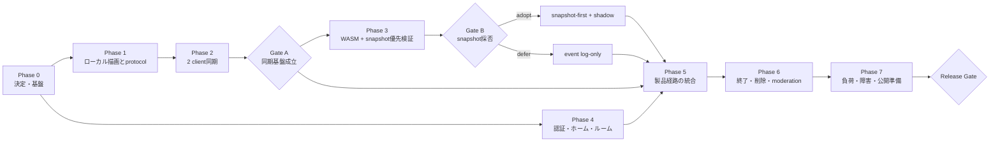

# お絵描きチャットMVP実装計画

更新日: 2026-07-29  
状態: Phase 0〜6、Phase 7主要検証、production初回配備まで完了。
公開運用Release Gateを進行中

## 1. 目的

この計画は、モックアップを公開運用できる最小のお絵描きチャットへ段階的に
置き換えるための実装順序、成果物、依存関係、判断ゲート、受け入れ条件と
現在の達成状況を定める。

最初の技術的成功である2クライアント同期と切断復帰は完了した。
共通WASM rendererとsnapshotはGate Bをpassし、snapshot-firstを採用した。
event log全再生はfallbackとして維持する。

本計画は次を入力とする。

- [`../notes/drawing-chat-service-design-foundation.md`](../notes/drawing-chat-service-design-foundation.md)
- [`../notes/drawing-chat-tech-stack-research.md`](../notes/drawing-chat-tech-stack-research.md)
- [`../notes/unified-home-room-list-design.md`](../notes/unified-home-room-list-design.md)
- [`../spec/README.md`](../spec/README.md)
- [`../spikes/README.md`](../spikes/README.md)
- `prototypes/v2/rooms/`
- `prototypes/v2/drawing-room/`

## 2. MVPの成果

MVP完了時に、次の利用経路が成立していることを目標とする。

1. 未ログイン利用者は公開ルーム一覧を閲覧できる。
2. ログイン済み利用者はpublicまたはunlisted roomを作成できる。
3. ゲストまたはログイン済み利用者は、許可されたルームへ参加または観覧できる。
4. 2-20接続のルームで、ブラシと消しゴムのstrokeを途中表示しながら同期できる。
5. 色、サイズ、濃度、スポイト、zoom、panはモックアップの操作方針で利用できる。
6. 再読み込み、短い切断、Durable ObjectのHibernation後にキャンバスへ復帰できる。
7. host終了、自動終了、活動量上限、管理停止を安全に処理できる。
8. 通常終了後はroom、event log、runtime snapshotを削除し、再入室できない。
9. 通報がある場合だけ、必要最小限の証跡を期限付きで分離保全できる。
10. 管理者が問題ルームの停止、kick、BAN、証跡確認を実行できる。

## 3. MVPに含めないもの

- 筆圧
- undo / redo
- ギャラリー
- 完成画像の生成・保存・公開
- プロフィール、参加履歴、フレンド、通知
- 複数レイヤー
- 画像貼り付け
- 高度なブラシ
- friends / private room
- 本格的なモバイル専用UI
- offline編集
- 課金

モックアップに残るMVP外の導線は、本実装で非表示にするか「未提供」と明示する。MVP外機能のためのschemaやstorageを先回りして作らない。

## 4. 推奨アーキテクチャとリポジトリ境界

現在の採用構成は次のとおり。

| 領域 | 推奨 |
| --- | --- |
| Web | Next.js + vinext + TypeScript |
| HTTP API | Cloudflare Workers + Hono |
| realtime | 1 room = 1 SQLite-backed Durable Object |
| connection | WebSocket Hibernation API |
| metadata / auth | D1 |
| room runtime / event | Durable Objects SQLite |
| runtime snapshot | R2。snapshot-firstを採用、productionはshadow mode |
| snapshot job | Cloudflare Queues + Workers WASM |
| drawing | provisionalはCanvas 2D、canonicalは共通WASM |
| auth | Better Auth。MVPではroom作成とownership復元に使用 |
| admin | Cloudflare Accessで保護 |
| protocol | 論理schema v1、MessagePack、数値wire opcode |

推奨するコード境界:

```text
apps/
  web/                 # 統合ホーム、入室、描画UI、HTTP frontend
  realtime/            # Hono API、room Durable Object、WebSocket
  snapshot/            # Queue consumer、Workers WASM snapshot
packages/
  protocol/            # schema、codec、validation、fixtures
  renderer-core/       # Rust/WASM rendererとBrowser / Workers JS境界
migrations/
  d1/
tools/
  event-log-benchmark/
  renderer-fixtures/
  realtime-benchmark/
  browser-recovery-benchmark/
  cloudflare-worker-metrics/
```

実際のpackage分割は、循環依存を避けられる最小構成に留める。protocol schemaとrenderer fixtureは、Web UIやWorkerへ重複定義しない。

## 5. 実装原則

1. local provisional描画はnetwork round tripを待たない。
2. serverはeventを永続化して`roomSeq`を確定してからbroadcastする。
3. event log先頭からの復帰を、snapshot採用後も必須fallbackとして維持する。
4. snapshot compactionはmanifest commitとprevious fallback境界が成立した場合だけ
   eventを削除する。現在のproductionはshadowでeventを保持する。
5. client由来のactor、role、roomSeq、acceptedAtを信用しない。
6. token、ticket、cookie、生IP、URL fragmentをログへ出さない。
7. room終了処理は冪等にし、外部I/O失敗でroomを再開しない。
8. rate limit、message size、point数、room上限をserverで検証する。
9. UI、protocol、storage、rendererの変更をfixtureとversionへ反映する。
10. 暫定値はコード各所へ直書きせず、設定と測定結果から追跡できるようにする。

## 6. 全体工程



推奨するcritical pathは次である。

```text
Phase 0 -> Phase 1 -> Phase 2 -> Gate A
        -> Phase 3 -> Gate B
        -> Phase 5 -> Phase 6 -> Phase 7 -> Release Gate
```

Phase 4のUI・認証トラックはPhase 0後に並行できる。ただしroom ownership、入室ticket、role判定をPhase 2の仮実装へ混ぜず、Phase 5で統合する。

## 7. Phase 0: 決定事項と開発基盤

状態: 2026-07-27完了。証跡は[`../results/phase0-completion.md`](../results/phase0-completion.md)を参照。

### 目的

実装を分岐させる小さな未決定事項を閉じ、同じschema・fixture・品質基準を全packageで利用できる状態にする。

### 作業

- `waiting -> active`をhost明示開始または最初のparticipant入室のどちらかに決定する。
- 最初のOAuth providerと、MVPでメール認証を含めるかを決定する。
- production / preview / localのoriginとcallback方針を決定する。
- account deletionの基本方針を決定する。
- package manager、workspace、Node.js、Rust toolchain、formatter、lintを固定する。
- Web、realtime Worker、D1、DO SQLite、R2、Queueのlocal/preview環境を分離する。
- secret、binding、migration、compatibility dateの管理方法を定める。
- CIでtypecheck、unit test、fixture test、buildを実行する。
- protocol、renderer、migrationのversioning規則をrepositoryへ適用する。
- decision recordと性能結果の保存先を用意する。

### このphaseで固定しないもの

- MessagePack / CBORの最終選択
- snapshotの採用
- event上限とrate limitの最終値
- rendererのfixed-point scale
- report証跡の最終保持期間

これらは後続phaseの測定または公開前decisionへ送る。

### Exit criteria

- clean checkoutからlocal buildとtestを再現できる。
- preview環境へWebとWorkerの最小health checkをdeployできる。
- D1/DO/R2/Queueのbindingが環境ごとに分離される。
- secretがrepository、fixture、logへ含まれない。
- 上記4つのアカウント・room開始判断がdecision recordに残る。

## 8. Phase 1: ローカル描画とprotocol package

状態: 2026-07-27完了。証跡は[`../results/phase1-completion.md`](../results/phase1-completion.md)を参照。

### 目的

モックアップの描画体験を本実装へ移植し、networkとrendererの双方が利用するprotocol v1を実行可能なschemaにする。

### 作業

- 960 x 640、白背景、論理サイズ固定のcanvasを実装する。
- brush / eraser / eyedropper / zoom / panを実装する。
- pointer inputを`stroke.begin/append/end/cancel`へ変換する。
- 50ms / 最大12 pointsの暫定batchingを実装する。
- 低濃度strokeを専用provisional layerへ描き、確定時にopacityを一度だけ適用する。
- protocolのruntime validation、encode/decode、error codeを実装する。
- `clientSeq`、stroke ID、未送信buffer、ack状態のclient modelを実装する。
- `tools/renderer-fixtures/v1/`をprotocol packageのtestへ接続する。
- raw stroke fixtureからevent fixtureを生成し、byte数を記録する。
- JSONをdebug codecとして維持し、MessagePackとCBORを同じfixtureで比較する。

### Gate: codec

次を比較し、MessagePackまたはCBORを採用する。

- encoded byte
- encode/decode time
- Browser / Workerの実装とbundle
- schema evolutionとdebug性
- 64KiBアプリframe上限の扱いやすさ

string / numeric opcodeはcodecと同時に決める。描画結果を変えずに圧縮できることをfixtureで確認する。

### Exit criteria

- モックアップの主要な描画操作をlocal実装で再現できる。
- 低濃度の高速strokeに継ぎ目の濃い縁が出ない。
- beginからendまでを同じstrokeとして再生できる。
- encode/decode round tripで論理eventが変化しない。
- invalid field、oversize frame、points上限を拒否できる。
- codec decisionと実測結果が記録される。

## 9. Phase 2: 2クライアント同期

実行票: [`../spikes/two-client-sync.md`](../spikes/two-client-sync.md)

状態: 2026-07-27 Gate A完了。証跡は[`../results/phase2-progress.md`](../results/phase2-progress.md)を参照。

### 目的

本番候補のDurable Object、SQLite、WebSocketで、最小の同期・永続化・復帰経路を成立させる。

### 作業

- 1 room = 1 Durable Objectを実装する。
- WebSocket Hibernation APIで接続を受け入れる。
- protocol v1をserverでvalidateする。
- `clientSeq`とstroke lifecycleで重複・順序違反を拒否する。
- SQLiteへpersistし、単調増加する`roomSeq`を付与してからbroadcastする。
- 未完了strokeを保存し、最後のappendから暫定2秒後に自動確定する。
- event log先頭からのcold replayを実装する。
- `lastRoomSeq`からのresumeと未ack eventの再送を実装する。
- snapshot workerへ渡せるevent chunk RPCの境界を用意する。
- duplicate、out-of-order、cancel、timeout、切断、DO再初期化を自動試験する。
- 2ブラウザE2Eでlocal/remote canvasを比較する。

### Gate A: 同期基盤

すべて満たせば次へ進む。

- 両clientが同じaccepted event列とlogical stroke集合を得る。
- reloadとresumeでevent欠落・二重適用がない。
- provisional表示と確定表示の間に不自然な濃度差がない。
- DO再初期化後もSQLiteとattachmentから処理を継続できる。
- reject、persist、broadcast、replayのmetricを取得できる。
- snapshot spikeへeventをchunk取得できる。

失敗した場合は、snapshotや製品UIへ進まず、protocol、永続化順序、client bufferを修正する。

## 10. Phase 3: 共通WASMレンダラーとsnapshot優先トラック

実行票: [`../spikes/snapshot-vertical-slice.md`](../spikes/snapshot-vertical-slice.md)

状態: 2026-07-28完了。canonical rendererからpreview性能、memory、70,020-event compaction canary、current/previous復帰まで成立し、Gate Bをpassした。MVPはsnapshot-firstを採用する。証跡は[`../results/phase3-renderer-stage-a.md`](../results/phase3-renderer-stage-a.md)、[`../results/phase3-renderer-stage-b.md`](../results/phase3-renderer-stage-b.md)、[`../results/phase3-snapshot-worker-generation.md`](../results/phase3-snapshot-worker-generation.md)、[`../results/phase3-snapshot-client-recovery.md`](../results/phase3-snapshot-client-recovery.md)、[`../results/phase3-snapshot-shadow-validation.md`](../results/phase3-snapshot-shadow-validation.md)、[`../results/phase3-snapshot-previous-fallback.md`](../results/phase3-snapshot-previous-fallback.md)、[`../results/phase3-snapshot-incremental-generation.md`](../results/phase3-snapshot-incremental-generation.md)、[`../results/phase3-snapshot-compaction.md`](../results/phase3-snapshot-compaction.md)、[`../results/phase3-room-close-snapshot-fence.md`](../results/phase3-room-close-snapshot-fence.md)、[`../results/phase3-snapshot-automation.md`](../results/phase3-snapshot-automation.md)、[`../results/phase3-snapshot-preview-performance.md`](../results/phase3-snapshot-preview-performance.md)、[`../decisions/0007-snapshot-first-recovery.md`](../decisions/0007-snapshot-first-recovery.md)を参照。

### 目的

Browser / Workers共通rendererの決定性と性能を確認し、snapshot + tail recoveryをMVP本線へ採用するか早期に決める。

### Stage A: canonical renderer

- Rustでfixed-point coordinate、curve、rounding、line cap、compositingを固定する。
- brush、eraser、opacity、dot、cancelを実装する。
- Browser / Workers向けWASM buildを作る。
- canonical fixtureからRGBA hashを生成する。
- Canvas 2D provisionalからWASM canonical resultへの置換を確認する。

実行票上のBrowser integrationまで完了。Canvas 2D provisional、stroke end時のWASM canonical置換、2 client一致、cold replay一致を確認した。

### Stage B: snapshot vertical slice

- Queueへjob metadataだけを送る。
- consumerがDO RPCからtarget `baseRoomSeq`までchunk取得する。
- WASMで960 x 640 RGBAへ描画し、lossless encodeする。
- temporary R2 objectを作り、object hashとRGBA hashを計算する。
- DOがjobとversionを検証してmanifestをcommitする。
- clientがsnapshotを検証し、tailを再生してlive eventへ追いつく。

2026-07-27時点でQueue、DO chunk RPC、WASM generation、lossless encode、R2 staging object、manifest commit、1回限りtokenによるprivate object取得、Browser検証、snapshot適用、tail / live catch-up、shadow full replay fallbackまでpreviewで成立。

### Stage C: shadowと障害試験

- shadow modeでは全eventを残す。
- Browser full replayとWorkers snapshotのhashを比較する。
- Queue重複、consumer crash、R2失敗、manifest失敗、破損objectを注入する。
- current/previous snapshotとevent log fallbackを試す。
- room終了中のsnapshot jobを安全に停止またはcleanupする。

2026-07-27時点で10k / 50k / 100kを各3回比較し、full replayと
snapshot + tailのRGBA hashは9/9一致した。100kのローカルp50はfull replay
18.25秒、snapshot + 約1,000-event tail 178.8msだった。R2欠落、metadata不整合、
object破損、version / RGBA hash不一致からfull replayへ戻る基本障害試験も成立。
previewの50,220-event初回生成はCPU 17.121秒、10,020-event増分は3.891秒で
commitした。20接続・約400 events/sと同時実行してbroadcast欠落は0、増分run全体の
ACK p95は196.7msだった。CPUはPaid Workerの既定30秒上限へ42.9%の余裕がある。
memory p999は31,596,578 bytesで128 MiB上限の23.5%だった。70,020-event
compaction canary後もcurrent + tail、previous + bridge/tail、409 fail-closedが
成立したため、Gate Bはpassとする。

current / previous / full replayの復旧順序、manifest commit再試行、R2 staging
conflict、superseded cleanupは自動試験済み。compaction点検で、previousから
currentまでのbridge event保持と、current snapshotを基点にしたincremental
generationがevent削除前の必須条件と判明した。これらが成立するまでshadow modeで
全eventを保持する。

previous境界までのchunk deletion、途中再開、重複実行、queued source保護、
compaction直後のfail-closed復旧、圧縮後のincremental generationはlocalと
disposable preview roomで成立した。通常roomの自動compactionは、Phase 6の終了
cleanupと監視を確認してから段階導入する。

room closeを先に永続化してqueued jobをsupersededへする終了フェンス、開始済み
Workerのmanifest commit再確認、staging object削除、close後のcompaction停止も
localとdisposable preview roomで成立した。証跡保全と最終cleanupはPhase 6で扱う。

`off` / `shadow` / `compact`のfeature flag、50,000 events / 16MiBの初回
trigger、10,000 events / 4MiBの再生成増分、completed-stroke boundary判定を
実装した。local / previewは`shadow`とし、自動削除は有効化していない。
`compact`ではmanifest commit後にDO alarmが最大500 eventずつ削除し、flagを
下げた場合は未実行予約を破棄する。

### Gate B: snapshot採否

判定: **pass — snapshot-firstを採用**（2026-07-28、ADR 0007）

次をすべて満たせばsnapshot-firstを採用する。

- Browser / WorkersのRGBA hashが100%一致する。
- snapshot生成とcanonical描画がlive input/broadcastを阻害しない。
- 利用するWorker制限へ30%以上の余裕を目標にできる。
- snapshot + tailがfull replayより明確に速い。
- Queue/R2/manifest失敗でevent lossがない。
- compaction前後の復帰とcleanupを自動試験できる。
- 運用複雑性がMVPの保守範囲に収まる。

いずれかを満たせなければ、MVPは`event_log_only`で続行する。WASM rendererだけ採用し、snapshotを延期する判断も許可する。延期を失敗扱いにせず、理由、実測、再検討条件をdecision recordへ残す。

### Exit criteria

- adoptの場合、`shadow -> snapshot_compacted`の前方向遷移が定義される。
- deferの場合、full replayでPhase 7の復帰性能試験を実行できる。
- どちらの場合も、同じprotocol fixtureからcanonical結果を再生成できる。

## 11. Phase 4: アカウント、統合ホーム、ルーム作成

認証実行票: [`../spikes/auth-d1.md`](../spikes/auth-d1.md)

状態: 2026-07-28完了。Better Auth 1.6.25、D1 migration、auth route、
cookie / Origin境界、公開room projection、統合ホームの基盤まで成立した。
local / preview D1へmigration適用済み。previewではGoogle OAuthのlogin、
callback、session、logout、session revoke、再login E2Eがpassした。
room作成contract、private Service Binding、D1 `pending -> ready`、
DO失敗時の補償・冪等再試行、sessionからのownership復元までpreviewへ反映した。
public room作成、room画面への移動、ownership表示、再login後の復元も
利用者E2Eでpassした。unlisted作成とinvite token交換は一体でPhase 5へ送る。
証跡は
[`../results/phase4-auth-home-foundation.md`](../results/phase4-auth-home-foundation.md)、
[`../results/phase4-room-provisioning.md`](../results/phase4-room-provisioning.md)
を参照。

このphaseはPhase 0後にUIトラックとして開始できる。Phase 2の同期spikeとは仮identityで分離し、Phase 5でticketとownershipを接続する。

### 認証

- Phase 0で決めたproviderをBetter Auth + D1で実装する。
- login、logout、session revoke、再loginを実装する。
- generated migrationをreviewしrepository管理する。
- Secure / HttpOnly / SameSite cookie、Origin検証、callback allowlistを適用する。
- room ownershipをuser sessionから復元する。
- ゲストによるroom作成をserverで拒否する。
- account deletion / suspended userの挙動を試験する。

### 統合ホーム

- `/`を統合ホームと公開ルーム一覧にする。
- `/rooms/`は同じ画面または`/`への転送に統一する。
- 非ログインとログイン後で共通のroom cardとlist APIを使う。
- 非ログイン時はゲスト参加、ログイン後は参加・room作成を表示する。
- モックアップの「参加中・最近見た」は、MVPに必要な開催中roomへの復帰だけに絞る。
- gallery、friend、notification、profile導線をMVP経路から外す。

### Room API

- Phase 4ではログイン済みuserだけがpublic roomを作成できる。
- unlisted room作成はinvite token交換と一体でPhase 5に実装する。
- public slug、内部room ID、invite tokenを分離する。
- D1のroom projectionとDO runtime stateを作成する。
- 作成途中のD1/DO失敗を補償できるようjobまたは状態を持つ。
- list APIで終了roomを返さない。
- 検索、filter、sortはMVPで必要な最小条件に絞る。

### Exit criteria

- login、room作成、logout、再login後のhost復元E2Eが通る。
- guest room作成がUIとserverの両方で拒否される。
- public roomは未ログインでも一覧表示できる。
- unlisted作成は交換経路が完成するまでAPIでも拒否される。
- 終了roomが一覧と復帰導線に残らない。
- Better Auth + D1のmigrationとpreview運用が再現できる。

## 12. Phase 5: 製品経路の統合

状態: 2026-07-28着手。public roomのHttpOnly guest session、room別actor、
60秒single-use ticket、role付きWebSocket接続、再接続時の新ticket取得を
previewへ反映した。同一actorは最新接続優先とする。participant / viewerの
参加選択、role表示・切替、viewerのclient/server二重描画防止、reload時の
role復元もpreviewでpassした。所有者アカウントによるhost表示・描画・reload
復帰も利用者E2Eでpassし、host / guest participant / viewerの3 role経路が
成立した。256-bit unlisted inviteのfragment受取、hash保存、短命ticket交換と
短時間切断後の同一actor復帰もpreviewへ反映した。unlisted作成、一覧非掲載、
別browser sessionからの招待入室、reload復帰も利用者E2Eでpassした。
非永続presence、viewerを含むremote cursor、独立cursor rate bucketも
preview自動スモークと別browser sessionによる利用者E2Eでpassした。
chatは最新100件 / 24時間TTL、本文500文字、2件/秒・burst 5、
viewer host設定、独立rate bucketをpreview製品経路へ反映し、自動スモークと
viewerブラウザ検証でpassした。lifecycle UIは継続中。証跡は
[`../results/phase5-room-ticket-foundation.md`](../results/phase5-room-ticket-foundation.md)
を参照。

### 目的

同期基盤、認証、room一覧、描画UIを、安全な参加・再接続経路へ統合する。

### Guest identityとticket

- HttpOnly guest session cookieを発行・rotationできるようにする。
- guest sessionとroomごとのactor IDを分離する。
- public slugまたはinvite tokenを短命なroom ticketへ交換する。
- ticketを暫定60秒、single use、session/room binding付きで検証する。
- WebSocket upgrade時にnonceを消費する。
- 再接続時は新ticketを取得し、`lastRoomSeq`から復帰する。
- 同一sessionの同時connection policyを決めて試験する。

### Roleとroom UI

- host / participant / viewer / adminをserverで判定する。
- viewerはデフォルト閲覧のみとする。
- host設定でviewer chat / stampを個別に許可する。
- waiting / active / idle / closing / suspendedをUIへ反映する。
- room開始条件をPhase 0のdecisionどおりに実装する。
- closing/suspendedでは描画・chat・再接続を適切に拒否する。

### Presence、cursor、chat

- presenceとcursorは非永続・best effortとしてpreviewへ反映済み。
- presenceはconnection attachmentから再構成し、cursorは最大20Hz、
  20/s・burst 30の独立bucketで制限する。
- chatは最新100件か24時間の早い方で保持する暫定値を実装済み。
- chat本文は500文字、2件/秒・burst 5とし、drawing/cursorとは別の
  rate bucketで制限する。
- cursor/presenceだけではidle activityを更新しない。
- chatとstampはidle activityへ含める。chatの活動時刻更新はlifecycle統合時に
  接続する。

### Recovery UX

- first drawingを優先し、復帰progressと再試行を表示する。
- recovery開始時のtarget roomSeqを固定する。
- recovery中のlive eventを上限付きqueueへ保持する。
- queue超過時は新しいtargetでやり直す。
- unsupported version、破損、room終了を区別して表示する。

### Exit criteria

- user host、guest participant、viewerの3 role E2Eが通る。
- 無効・期限切れ・失効済みinvite tokenを拒否できる。
- room ticketと再接続用room ticketはsingle useで、再利用を拒否できる。
- reloadと短い切断後に同じroom stateへ復帰できる。
- snapshot採用時はsnapshot + tail、延期時はfull replayで同じ結果になる。
- role違反とrate limit rejectがclientへ安全に表示される。
- token、ticket、cookie、生IPをlogへ出さない。

## 13. Phase 6: lifecycle、削除、荒らし対策、管理

Hibernation実行票: [`../spikes/websocket-hibernation.md`](../spikes/websocket-hibernation.md)  
終了処理実行票: [`../spikes/room-close-cleanup.md`](../spikes/room-close-cleanup.md)

### Room lifecycle

- waiting、active、idle、closing、suspendedを永続化する。
  waiting / active / idleとhost明示開始は2026-07-28にpreview利用者E2Eまでpass。
- host終了、全員退出後10分、作成から2時間、管理停止を実装する。
  host終了は2026-07-28にpreview利用者E2Eまでpass。
  全員退出後10分と作成から2時間はlocal自動テストまでpass。
- 100,000 drawing eventsまたは64MiBでsoft closeする。
  2026-07-28に93,000 events / 56MiBのsoft limit、終了処理予約、
  `activity_limit` closingを実装しpreviewへdeploy済み。
- 15分、5分、1分前と、80%、90%、98%到達時に予告する。
  活動量の80%、90%、98%通知と、最大時間の15分、5分、1分前通知は
  2026-07-28に実装済み。通知段階はHibernation・再接続後も復元する。
- 新規strokeを止め、開始済みstrokeを終端してからclosingへ進む。
  2026-07-28に新規begin拒否、append/end/cancel/timeoutのdrain、
  未完了stroke 0件でのclosingを自動テスト済み。
- DO SQLiteの`scheduled_tasks`と単一alarmで期限を管理する。
  `idle_timeout`、`empty_timeout`、`max_duration`は2026-07-28に実装済み。

### Cleanupと証跡

- closingを最初にpersistし、以後の新規操作を拒否する。
- 未解決reportがある場合だけevidence jobを作る。
- evidence commit前に元event/snapshotを削除しない。
  2026-07-28に最小D1 schemaとcleanupのfail-closed fenceを実装し、
  実D1/R2/DO統合fixtureで確認済み。report API、利用者dialog、
  固定snapshot + tailのevidence Queue job、DLQ/health/runbookも実装済み。
- WebSocketへ`room.closed`を通知して閉じる。
  2026-07-28にprotocol、Realtime、Webへ実装しpreviewへdeploy済み。
- list projection、DO SQLite、D1、R2を冪等に削除する。
  通常終了経路は2026-07-28に専用QueueとD1 job fenceを使い、
  R2 -> DO -> D1の順で削除する実装をpreviewへdeploy済み。
  同日の配備後新規roomで終了・一覧除外・再入室拒否を利用者E2E確認し、
  終了後にD1 room行が残っていないことをread-only queryで確認済み。
- R2 cleanup失敗を再試行し、上限後はDLQと管理metricへ送る。
  5回retry後のDLQ退避、Queue/DLQ/stuck projection health、R2/DO/D1の
  failure injection、D1 migration + R2 + DO + D1物理削除の統合fixture、
  再投入runbookを2026-07-28に実装済み。
- strict key、1時間grace、D1 roomとDO job/manifest照合によるruntime snapshot
  orphan scanを毎日実行する。最大10,000 object / 500 roomでfail closedにし、
  D1 inventoryとhealthへ投影するがR2は自動削除しない。
  2026-07-28にmigration、scheduled scan、localhost限定の手動scan tool、
  runbookをpreviewへ実装済み。
- 孤児削除は通常Webから分離した専用Service Entrypointとlocalhost operatorで
  行う。連続scan、最大100件、30分期限、plan hash、明示confirmation、
  適用直前scan、R2 metadata一致を必須にし、生keyを含まないD1監査記録を残す。
  toolと自動試験は2026-07-28に実装済み。同日、明示承認後に旧preview候補
  10件を適用し、inventory 0、監査記録、正常health復帰を確認済み。
- backupから終了済みroomを復活させない。

### Abuse controlと管理

- actor、guest session、user、短命なnetwork abuse keyを用途別に使う。
- message rate、frame byte、point数、stroke時間、connection数を制限する。
- reject、short mute、disconnect、room ban、service banを段階化する。
  2026-07-28に描画・チャットのrate超過をroom actor単位で合算し、
  10秒内3回で5秒mute、8回でconnectionを1008切断する段階制御を実装した。
  状態はDO SQLiteへ保存し、Hibernationと再接続後も継続する。rate超過描画は
  順序消費・client ackし、active strokeをserver確定する。自動room BANは行わない。
  2026-07-29にcleanup直前の最終counterを個人情報なしで30日保持し、
  稼働中roomと終了roomを重複なくbaseline比較するlocalhost限定operatorを
  実装した。同日のpreview baselineではlive room 2、accepted drawing event
  4,026、rate limited / mute / disconnect 0を記録した。closed betaの通常利用値を
  取得してから暫定閾値を評価する。
- adminによるsuspend、close、kick、BANを実装する。
  2026-07-28に非公開Service Binding、DO lifecycle、D1監査記録まで
  suspend / closeを実装済み。同日にCloudflare Accessで保護した公開管理APIと
  管理画面をpreviewへ配備し、未認証の画面/APIがAccess loginへredirectされる
  ことを確認済み。Access認証済み利用者E2Eでも管理停止、接続終了、
  再入室拒否、suspendedからの強制終了、一覧除外までpassした。
  2026-07-28に接続中member一覧、kick、room BAN、対象strokeの自動確定、
  全connection切断、D1 + DOの再入室fence、ホスト保護を実装しpreviewへ配備した。
  kickは自動再接続を止めるが明示的な再入室は許可し、room BANはroom終了まで
  user / guest subjectの再入室を拒否する。同日の利用者E2Eでkick対象だけの切断、
  手動再入室、room BAN後の再入室拒否、非対象connection維持までpassした。
  2026-07-29にservice-level BANを専用D1 table、全room ticket / room作成fence、
  稼働中membershipのDO切断、Access管理UI、解除監査まで実装した。期間は
  24時間 / 7日 / 30日（既定7日）で、永久BANとIP BANは採用しない。
  有効終了後180日でBANと対応するmoderation actionを削除する。
- emergency modeで新規room作成、新規入室、必要なら描画受付を停止できるようにする。
  2026-07-28に3項目を独立制御するD1 authoritativeな設定、監査記録、
  Access保護済み管理UI、Web/DO fenceを実装しpreviewへdeploy済み。
  描画停止は最大5秒cacheし、開始済みstrokeをserver確定して停止中frameを
  順序消費する。初回利用者E2Eで、外部D1 read中に同じWebSocketの描画frameが
  interleaveする問題を検出し、接続単位の順序queueへ修正・再配備した。
  room作成・入室の停止復旧に加え、通常描画、描画停止時の通知と線の破棄、
  描画再開後の新規strokeまで2026-07-28のpreview利用者E2Eでpassした。
- 管理画面をCloudflare Accessで保護する。
  `Cf-Access-Jwt-Assertion`をWorkerでもRS256署名、issuer、audience、
  exp / nbfまで検証し、生emailと生`sub`を監査表へ保存しない。
- 管理操作を最小metadataで監査する。
  `moderation_actions`へpending / applied / failed、admin内部ID、理由、
  lifecycle結果を記録する基盤を2026-07-28に実装済み。

### 公開前に確定する値

- report evidenceの保持期間と削除job
  暫定30日。期限scan、Queue、R2 -> D1の冪等削除を2026-07-28に
  previewへ実装済み。公開前に保持日数を最終決定する。
- salted IP/UA-derived keyの保持期間とsalt rotation
- moderation action / service-level banの保持期間
  room banはroom終了までとし、room cleanupで削除する。service banと対応actionは
  有効終了後180日。その他のmoderation actionは公開前に確定する。
- cleanup retry上限とDLQ対応
- WebSocket close code
- backup範囲、復旧目標、復元除外

### Exit criteria

- host close、自動終了、活動量上限、admin closeが冪等に完了する。
- 通常終了後にroom/event/runtime snapshotが残らず、再入室できない。
- reportありでは証跡がcommitされるまで元dataが残る。
- cleanup途中のrestart、duplicate job、R2/D1失敗から再試行できる。
- Hibernation wake後もactor/role/roomSeqを取り違えない。
- abuse testで正常な描画を維持しながら異常入力を抑制できる。

## 14. Phase 7: 性能、障害、公開準備

測定条件: [`../spec/load-test-plan.md`](../spec/load-test-plan.md)

### 性能試験

- 実操作fixtureを複数人分追加し匿名化する。
- 10k / 50k / 100k eventsをMVP判定として測る。
- 150k / 250k / 400k eventsは上限見直し材料として測る。
- 2、10+10、20 mixed connectionsを測る。
- 20 connection同時cold recoveryを測る。
  2026-07-29にparticipant / viewerを分離したmixed connection、
  最大20 viewer同時cold recovery、3回以上の反復集計、正式guest ticket経路を
  測るschema v2 suiteを実装した。local 4 scenario × 3回のsmall smokeでは
  broadcast欠落0、recovery event件数不一致0だった。
  previewのparticipant 10 + viewer 10、9,990 events × 3回でも、
  599,400 broadcast deliveriesの欠落0、各runのfull replay件数不一致0を確認した。
  ack p95のrun medianは142.55msだが、3 run目は380.54ms、max 2.38秒のため、
  remote性能は別room再測定まで継続評価とする。同じ時間窓のWorker metricsは
  125 requests / errors 0、memory p999最大約2.37 MiBであり、resource超過は
  外れ値の原因ではなかった。
  別roomの20 simultaneous full replayでは、20接続すべてのevent件数が10k / 20k /
  30k各段階で完全一致した一方、complete p95は10.20秒 / 42.44秒 / 131.94秒となり、
  10k時点から性能目標を満たさなかった。full replayはcorrectness fallbackにはなるが、
  性能fallbackとして不十分である。同時間窓のWorker metricsは126 requests /
  errors 0、memory p999最大約2.41 MiBで、CPUのAPI生値も10+10試験を上回らなかった。
  resource上限ではなくreplay fan-out経路を主要候補とし、snapshot + bounded tailを
  本線に維持する。snapshot-required測定器はWeb client共通のobject/RGBA hash検証を
  使用し、20接続それぞれのsnapshot baseとtail期待件数を検証する。
  previewの60k / 70k / 80k時点で20同時復帰を実測し、60接続すべてhash・tail件数が
  一致した。ready p95は9.40秒 / 10.46秒 / 8.74秒で累積悪化は解消したが3秒目標は
  未達のため、約10k tailの同期fan-outを次の最適化対象とする。同時間窓のRealtime
  Workerは222 requests / errors 0、memory最大約2.38 MiB。Snapshot Workerは
  4 invocations / errors 0で、full generation memory最大約35.05 MiB、後続incremental
  generationは約21.80 MiBだった。resource headroomは十分だが、最初のfull generationは
  `clientDisconnected`後、約58秒でsuccessへ収束しており、job attempt時系列の
  observabilityを追加する。Realtime復帰経路にはevent / frame / encoded bytes /
  cache hitの構造化ログを追加した。約10k tailは1接続40 frames、約2.59 MBで、
  同一rangeのencode済みframeを最大8 MiBまで1-entry共有する実装をpreview Worker
  version `43e9d904-3e42-4fa0-bedc-f01a37dab23d`へ配備した。同条件の単独runで
  offer p95は3.44秒から0.64秒、ready p95は11.72秒から7.28秒へ改善し、hash /
  tail不一致0だった。5,001 tailではoffer p95 0.43秒、ready p95 5.12秒であり、
  残る主因は接続ごとのtail配送とクライアント処理である。対照Worker metricsは
  359 requests / errors 0、memory最大約2.57 MiB。約10k tailの配備前後でmemory差は
  約4 KiB、success bucketのCPU p99最大値は31.4%低下し、resource悪化はなかった。
  Chrome DevTools MCPを接続し、Web clientにはsnapshot fetch / hash / decode /
  pixels適用、tail frame / event / bytes / decode / apply、ready後paintを分解する
  非識別の`koge.browser-recovery.v1`計測を追加した。preview Web Worker version
  `dbfa30fd-cf7d-46d6-b738-6419dfb10dc6`へ配備し、トップページの非throttle基準は
  LCP 466ms、CLS 0、TTFB 204msだった。次は新規roomでChrome標準条件を3回測り、
  snapshot intervalの費用対効果とCPU / RTT条件を1要因ずつ比較する。必要なら
  yield / backpressureを比較する。
  実測ではbase 50,002 + tail 5,013のpaint medianが標準1.92秒、CPU 4x 5.22秒、
  Slow 4G 7.85秒だった。base 60,007の10k増分snapshot commit後にtailを3へ戻すと、
  それぞれ720ms、674ms、1.38秒となり、62.4% / 87.1% / 82.4%短縮した。
  全18 browser runsでbase / tail不一致とtimeoutは0。5k intervalは有力候補だが、
  Queue回数、Worker CPU / memory、R2 write増加を10kと比較してから採否を決める。
  previewだけ5kへ変更したRealtime Worker version
  `d2d9bf13-55bb-48e7-87fe-faca0370b972`を配備し、base 65,023のincremental
  snapshot commit、tail 3の不一致0を確認した。50kから90kまでの単純モデルでは
  job総数が5から9、incremental jobは2倍になる。Analytics tokenを同じshellへ
  exportして取得した5k jobはsuccess、errors 0、CPU API生値1,923,344、memory
  約17.48 MiBだった。10k job 2 samplesよりCPUは38.0〜53.5%、memoryは19.8%小さい。
  5k job 2回のCPU単純推定は10k job平均より6.3%高い程度であり、復帰短縮効果を
  優先してpreviewでは5kを維持する。本番既定値への昇格前に、異なるroomで5k
  incremental jobを最低3件まで測る。
  Chrome CDPへ50 / 200 / 500msの最小request latencyを設定する
  `tools/browser-recovery-benchmark`も追加した。viewer / 正式guest ticket経路で
  各条件3回以上を測り、same-origin calibrationとsnapshot / tail / paint内訳を
  保存する。slug、cookie、ticketは保存しない。unit 5件、CDP 50ms smoke、lint、
  typecheck、全testはpassした。新規roomのbase 60,066 + tail 3で各条件3回を実行し、
  9 runsすべてsnapshot / base / tailが一致、timeout 0だった。ready後paint medianは
  50ms条件697.1ms、200ms条件655.1ms、500ms条件1,179.1ms。50 / 200msは
  same-origin校正値が逆転したため差を性能差とは扱わず、506〜508msへ収束した
  500ms条件ではpaint最大1,181.2msだった。同roomで5k境界を2回通過し、最終
  snapshot baseが60,066へ進んだ。Analyticsでは独立したincremental invocation
  2件を確認し、既存分を含む5k 3 samplesはすべてsuccess、errors 0、memory
  約17.48 MiBだった。CPU平均は1,715,265で、5k 2回のCPU単純推定は10k job平均より
  5.2%低い。復帰改善、CPU、memory headroomを総合し、
  `SNAPSHOT_MIN_EVENT_DELTA=5000`を本番を含む既定値へ昇格した。previewはすでに
  5kであり再配備は不要。次は成功率、Queue滞留、R2 object数、CPU総量を継続監視する。
  詳細は
  [`../results/phase7-performance-foundation.md`](../results/phase7-performance-foundation.md)。
- 50 / 200 / 500ms RTTと短い切断を試す。
- desktop、低性能相当、Chrome、Safari、Firefoxで測る。
- 各条件を3回以上実行し、medianとp95またはmaxを保存する。

### 初期性能目標

| metric | 目標 |
| --- | ---: |
| local provisional p95 | 32ms以下 |
| remote provisional p95 | 250ms以下 |
| remote committed | 1秒以下 |
| standard client first drawing | 500ms以下 |
| standard client 100k full recovery | 3秒以下 |
| low-end client first drawing | 1秒以下 |
| low-end client 100k full recovery | 8秒以下 |
| snapshot/full canonical hash | 100%一致 |
| snapshot failure event loss | 0 |

目標未達時は、append batching、chunk、codec、event上限、snapshot trigger、connection上限を一度に変えず、1項目ずつ測定する。

### 障害・セキュリティ試験

- WebSocket切断、再接続、duplicate、out-of-order
- DO restart / Hibernation wake
- D1 timeout、DO storage failure
- Queue duplicate / retry / DLQ
- R2 PUT / GET / delete失敗
- snapshot破損、version不一致、manifest不整合
- closing中の描画、chat、join
- ticket期限切れ、再利用、別session/roomからの使用
- oversized frame、points flood、connection flood
- auth callback/state、session revoke、CSRF / Origin
- logへのsecret/token/PII混入確認

### 公開準備

- 利用規約、プライバシーポリシー、コミュニティガイドラインを用意する。
- 通報、BAN、証跡開示・削除、緊急停止の運用者と手順を定める。
- dashboard、alert、runbookを用意する。
- cost上限と異常増加alertを設定する。
- production migrationとrollback手順を試す。
  2026-07-29に空のproduction D1へ`0001`〜`0017`を適用し、
  Realtime、Snapshot、Webの順で初回配備した。home / session / rooms /
  Realtime health / Access redirectの機械的smokeはpassした。証跡は
  [`../results/production-initial-deployment-2026-07-29.md`](../results/production-initial-deployment-2026-07-29.md)。
  同日の利用者E2EでOAuth、room、別browser、描画/cursor/chat/reload、
  host終了、Access管理画面をpassした。終了後はD1 room 0、cleanup / evidence
  Queue・DLQ backlog 0、stuck projection 0を確認した。初回配備時間窓の
  Realtime Worker Analyticsはerror 0、memory headroomをpassし、Snapshotは
  trigger未到達でsample 0だった。WebもCPU / memoryをpassした。
  Webの2 errorsは`05:32:19Z`の同一sampleに限られ、初回Custom Domain伝播直後の
  home / session一時500と一致し、`05:33Z`以降は再現しなかったため、
  既知の配備時過渡エラーとして初回Worker Analytics gateをpassとした。
- backup/restore試験で、終了済みroomを復活させないことを確認する。
- 小規模closed betaでshadow metricと利用者feedbackを得る。

### Release Gate

次をすべて満たした場合だけ公開候補とする。

- MVP利用経路のE2Eがproduction相当previewで通る。
- Gate Aがpassしている。
- Gate Bのadopt/defer判断が記録され、選択した復帰方式が負荷目標を満たす。
- room終了とcleanupの障害試験が通る。
- rate limit、管理停止、emergency modeが動作する。
- 重大な未解決security issueがない。
- retention、規約、通報、backup、alert、runbookが確定している。
- 既知の制約とrollback条件を公開判断者が確認している。

## 15. Workstreamと依存関係

| Workstream | 主なphase | 依存 | 主な成果 |
| --- | --- | --- | --- |
| A. Protocol / Client drawing | 1-2 | Phase 0 | schema、codec、batching、provisional |
| B. Realtime / Storage | 2、5-6 | A | DO、roomSeq、replay、resume |
| C. Renderer / Snapshot | 3 | Gate A | WASM、hash、R2、recovery、採否 |
| D. Web / Product UI | 4-5 | Phase 0、Gate A | 統合ホーム、room UI、入室 |
| E. Auth / Identity | 4-5 | Phase 0 decision | Better Auth、guest、ticket、role |
| F. Lifecycle / Moderation | 6 | B、D、E、Gate B | close、evidence、cleanup、admin |
| G. Quality / Operations | 全phase、7 | 各成果 | CI、metric、load、runbook、release |

並行作業は境界を先に固定してから行う。

- A/B間: protocol types、ack/reject、event ordering
- B/C間: event chunk RPC、manifest commit、room close cancellation
- D/E間: session response、room creation API、server-side auth state
- B/E間: ticket claims、actor/role attachment、reconnect
- C/F間: snapshot cleanup、evidence copy、room close race

## 16. Decision gates一覧

| Gate | 期限 | 判断 | fallback |
| --- | --- | --- | --- |
| Room start | Phase 0 | host明示 / participant入室 | host明示を安全側候補 |
| Auth scope | Phase 0 | provider、email、account deletion | provider 1つ、メールなしの最小構成 |
| Frontend scaffold | Phase 0 | Next.js + vinextが成立するか | React + Vite + TypeScript |
| Codec | Phase 1 | MessagePack / CBOR、opcode | JSON debug codecでspike継続 |
| Gate A | Phase 2 | 同期基盤が成立したか | protocol/storageを修正 |
| Gate B | Phase 3 | snapshot-first採用 | event_log_only |
| Event limits | Phase 7 | 100k / 64MiB / 2時間 | 実測に基づき安全側へ調整 |
| Public release | Phase 7 | 運用を含め公開可能か | closed beta継続 |

fallbackは計画上の正規経路であり、場当たり的な代替実装にしない。

## 17. 品質保証

### Unit / fixture

- protocol encode/decode/validation
- ordering、dedupe、stroke lifecycle
- renderer canonical fixtureとRGBA hash
- lifecycle state transition
- ticket claims、expiry、single use
- cleanup/evidence jobの冪等性

### Integration

- DO SQLite persist + broadcast
- Hibernation attachment + SQLite recovery
- D1 room projection + DO creation/cleanup
- Better Auth + D1 session/ownership
- Queue + R2 + manifest commit

### E2E

- host作成 -> guest参加 -> 同時描画 -> reconnect -> host終了
- viewer参加 -> 権限拒否 -> host設定変更
- unlisted invite交換 -> ticket消費
- event logまたはsnapshotからcold recovery
- 自動終了 -> list除外 -> data削除
- report -> evidence保全 -> room削除
- admin suspend / kick / BAN / emergency mode

すべての障害試験で、event loss、権限昇格、終了roomの復活、secretのlog露出を重大失敗とする。

## 18. 観測項目

最低限、次をroom IDの内部参照とrequest/job IDで相関できるようにする。

- active connection、role別connection
- accepted/rejected message rateと理由
- encoded event bytes、total drawing events
- persist / broadcast latency
- unfinished stroke timeout
- replay first drawing / complete
- recovery retryとlive catch-up queue
- Hibernation wake
- snapshot Queue delay、生成時間、hash、fallback
- room close step、retry、DLQ、orphan object
- auth failure、ticket reject、rate limit、moderation action
- D1/DO/R2/Queue利用量と概算cost

chat本文、stroke payload全体、token、生IPは通常logへ残さない。

## 19. リスクと対処

| リスク | 早期検知 | 対処 |
| --- | --- | --- |
| 共通WASMがBrowser/Workersで一致しない | Phase 3 fixture hash | snapshotを延期しCanvas 2D/event logへ戻す |
| snapshot生成がWorker制限を超える | 100k fixtureとmemory/CPU測定 | trigger調整、専用処理検討、MVPはevent log-only |
| full replayが低性能端末で遅い | Phase 2/7 cold replay | event上限縮小、yield/chunk改善、snapshot再検討 |
| low opacity確定でちらつく | Phase 1 visual/fixture test | provisional/canonical合成規則を修正 |
| D1とDOに孤児が残る | room作成・cleanup failure injection | job化、冪等補償、orphan scan |
| cleanupが証跡を先に消す | Phase 6 report scenario | evidence commitを削除条件にする |
| guest/ticketが権限昇格に使われる | ticket abuse E2E | identity分離、nonce、session binding |
| rate limitが通常描画を阻害する | 実fixtureとnetwork matrix | bucket分離、暫定値調整 |
| frontend adapterが不安定 | Phase 0 build/preview | React + Vite構成へ切替 |
| 公開後の運用負担が大きい | closed betaのalert/runbook | connection/room上限、招待制、公開延期 |

## 20. 実装単位の完了条件

各taskは原則として次を満たして完了とする。

- 対応する仕様またはdecision recordへリンクしている。
- happy pathと主要reject/error pathのtestがある。
- protocol、schema、migration変更はversionとfixtureを更新している。
- metricと安全なerror logがある。
- localまたはpreviewで再現手順がある。
- fallbackまたはrollback条件が明記されている。
- user-visibleな変更はkeyboard、focus、pointer/touch、狭い画面を確認している。
- secret、token、不要な個人情報を保存・出力していない。

## 21. Milestone完了条件

### MVP 1: 描画同期の技術検証

- Phase 0-3完了
- Gate A pass
- 2-20接続の基本測定
- event log cold replayとresume成立
- Phase 3のadopt/defer判断まで実施

### MVP 2: アカウントとルームサービス

- Phase 4-5完了
- ログインuserのroom作成とhost復元
- guest参加、viewer、presence、chat
- 選択した復帰方式の統合
- 複合上限とsoft closeの製品UI

### MVP 3: 公開前の運用

- Phase 6-7完了
- 通常終了時の完全削除
- 通報時の期限付き証跡
- kick / BAN / admin close / emergency mode
- 負荷、障害、security試験
- 規約、retention、backup、alert、runbook
- Release Gate pass

## 22. 実施した推奨順

実装は次の順で進めた。

1. Phase 0の4決定を短いdecision recordへ残す。
2. workspaceとCIを作る。
3. `packages/protocol`とlocal drawing inputを実装する。
4. [`../spikes/two-client-sync.md`](../spikes/two-client-sync.md)を実行する。
5. Gate A pass後、[`../spikes/snapshot-vertical-slice.md`](../spikes/snapshot-vertical-slice.md)を実行する。
6. 並行して[`../spikes/auth-d1.md`](../spikes/auth-d1.md)と統合ホームの本実装を進める。
7. Gate Bの結果を固定してから、製品room recoveryとcleanupを統合する。

Gate AとGate Bの結果を受けてPhase 3以降を細分化し、Phase 6の運用境界、
Phase 7の性能測定、production初回配備まで完了した。残る作業は本書の
Release Gateとproduction配備結果を正本とする。
