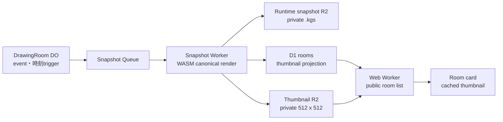

# 1000 x 1000キャンバス・公開ルームサムネイル実装計画

作成日: 2026-07-30
状態: 計画確定、未実装

## 1. 目的

論理キャンバスを1000 x 1000の白い正方形へ変更し、公開ルーム一覧に開催中の
canonical canvasを反映した正方形サムネイルを低負荷で表示する。

サムネイルは完成画像やギャラリーではなく、開催中ルームの一覧表示にだけ使う
一時的な派生データとする。最新状態への追従は保証せず、描画、snapshot recovery、
ルーム終了を阻害しないことを優先する。

本計画は次を前提とする。

- [`mvp-implementation-plan.md`](./mvp-implementation-plan.md)
- [`../decisions/0007-snapshot-first-recovery.md`](../decisions/0007-snapshot-first-recovery.md)
- [`../spec/event-log-recovery.md`](../spec/event-log-recovery.md)
- [`../spec/room-lifecycle.md`](../spec/room-lifecycle.md)
- [`../spec/data-model.md`](../spec/data-model.md)
- [`../setup/production-deployment.md`](../setup/production-deployment.md)

## 2. 固定する仕様

- 論理キャンバスは1000 x 1000、白背景、不透明sRGBとする。
- 100%表示では1論理pxを1 CSS pxとして扱う。
- viewport変更だけでは論理サイズと表示倍率を変えない。
- canvas downloadは1000 x 1000で出力する。
- サムネイルは512 x 512の正方形とする。
- encodingはWebPを第一候補とする。
- Workers/WASMで十分軽いWebP実装が成立しない場合はPNGへ戻す。
- 公開中のpublicルームだけを生成・配信する。
- unlistedルームではサムネイルを生成しない。
- サムネイル未生成時は現在の共通placeholderを表示する。
- 正常な新画像をcommitするまでは以前のサムネイルを維持する。
- ルーム終了時にD1参照とR2 objectを削除する。
- 終了後の保存、公開、再利用は行わない。

## 3. 全体構成



一覧requestではevent replay、snapshot decode、画像生成を行わない。D1の参照と
キャッシュ可能な画像配信だけを行う。

## 4. キャンバスとprotocolの変更

1. `PROTOCOL_LIMITS.canvasWidth`と`canvasHeight`を1000へ変更する。
2. Browser、Realtime、Snapshot Worker、fixture、download、座標validation、
   snapshot manifest検証を共通定数へ追従させる。
3. CSSに残る960 x 640の固定値を1000 x 1000へ変更する。
4. zoom、pan、remote cursor、eyedropper、狭いviewport、chat開閉を確認する。
5. canonical renderer fixtureとhealth hashを1000 x 1000で再生成する。
6. canvas寸法をsnapshot互換性境界として扱い、protocol versionまたは
   canvas generationを更新する。
7. renderer versionは描画規則または縮小規則のcontractを変更する場合だけ更新する。
8. 960 x 640の開催中ルームとsnapshotを1000 x 1000へ暗黙変換しない。

1000 x 1000 RGBAは4,000,000 bytesで、従来の2,457,600 bytesから約62.8%増える。
既存のmemory headroomだけで採用判断せず、previewでfull / incremental snapshotの
CPU、memory、wall time、R2 object bytesを再測定する。

## 5. 通常のサムネイル生成

通常のsnapshot jobでは、WASM rendererがtarget `baseRoomSeq`まで再生して得た
1000 x 1000 RGBAを復元用snapshotと共有する。サムネイルのための追加event replayは
行わない。

処理順は次のとおり。

1. lossless runtime snapshotをR2へ保存する。
2. DOがmanifestを検証してcommitする。
3. 同じRGBAを512 x 512へ縮小してencodeする。
4. サムネイル専用の非公開R2 bucketへversion付きobjectを保存する。
5. D1 projectionを、より新しい`baseRoomSeq`の場合だけ更新する。
6. 参照されなくなった旧objectをcleanup対象へ登録する。

object keyは次を基本形とする。

```text
rooms/{internal-room-id}/thumbnails/{base-room-seq}.webp
```

公開slug、user名、tokenをkeyへ含めない。Queue再送と順序逆転を考慮し、
生成、R2 PUT、D1更新、旧object cleanupを冪等にする。

復元用snapshotのcommit後にサムネイル生成だけが失敗した場合は、
commit済み`.kgs`を入力にサムネイル処理だけを再試行する。eventを再取得・再生せず、
復元用snapshotの成功も取り消さない。

## 6. 初回サムネイルの時刻trigger

既存の50,000-event初回snapshot条件だけでは描画量の少ないルームに画像が付かない。
そのためpublicルームには、時刻を条件とする初回生成を必須で組み込む。

初期値はルーム開始から5分とする。

- ルームが`active`になった時点で、5分後のone-shot taskをDO SQLiteへ永続化する。
- 5分以内に通常snapshotとサムネイルがcommitされた場合はtaskを取り消す。
- 期限時点でcompleted strokeが1件以上あり、active strokeがなければ、現在の
  completed-stroke boundaryをtargetに通常のsnapshot jobを1件だけenqueueする。
- 期限時点で描画がなければ定期pollingしない。
- 未描画の場合はtaskを「描画待ち」にし、期限後の最初のcompleted strokeで
  1件だけenqueueする。
- active stroke中なら、そのstrokeが確定した境界まで待つ。
- activeまたはidleの開催中ルームだけを対象とする。
- waiting、closing、suspended、終了済みルームでは新規jobを開始しない。
- ルーム終了、visibility変更、既存サムネイルcommitでtaskを失効させる。
- job IDとDO SQLite stateでat-least-once deliveryを重複排除する。

このjobはサムネイル専用の近似描画を作らず、通常のlossless runtime snapshotも
同時に生成する。publicルームあたりの追加full replayを最大1回に抑え、以後は
採用済みの5,000-event増分snapshotへ相乗りする。

5分は暫定値とし、次を測定して変更する。

- 初回サムネイル表示率
- placeholder表示時間
- Queue delay
- Snapshot Worker CPU / memory / wall time
- R2 write数とobject bytes
- 初回jobと通常snapshotの重複率

## 7. Storageとprojection

preview / productionにサムネイル専用の非公開R2 bucketを用意する。

想定名:

```text
koge-room-thumbnails-preview
koge-room-thumbnails-production
```

runtime snapshot bucketとmoderation evidence prefixから分離する。

bindingは次のとおり。

- Snapshot Worker: thumbnail R2書込、D1 projection更新
- Web Worker: thumbnail R2読取
- Realtime Worker / DO: 初回時刻triggerとsnapshot job enqueue

D1 `rooms`へnullableな列を追加する。

```text
thumbnail_object_key
thumbnail_base_room_seq
thumbnail_updated_at
```

Snapshot WorkerのD1更新では、次を一つの条件付きUPDATEで検証する。

- 対象ルームが現在も存在する
- `visibility = 'public'`
- statusが`active`または`idle`
- 新しい`baseRoomSeq`が保存済みの値より大きい

D1 migrationはadditiveにし、古いWeb / Realtime / Snapshot Workerでもnullable列の
存在により動作を壊さない。

## 8. 配信とトップページ

public room一覧responseにはR2 object keyを直接出さない。versionを含む同一originの
URL、またはURL生成に必要な公開情報だけを返す。

配信endpoint:

```text
/api/rooms/{public-slug}/thumbnail?v={base-room-seq}
```

endpointは次を満たす。

- 現在開催中のpublicルームだけを対象とする。
- D1が現在指しているobjectだけを配信する。
- runtime `.kgs`を取得できる経路を作らない。
- version付きURLにETagと長いimmutable cacheを設定する。
- 未生成、存在しない、削除済みの場合はplaceholderへfallbackする。
- unlisted、closing、suspended、終了済みルームはfail-closedにする。

トップページのルームカードは正方形画像を`aspect-ratio: 1`で表示する。
現在の共通画像は未生成時とfeature flag停止時のfallbackとして残す。

## 9. Cleanup

サムネイルはruntime snapshotと同じく開催中だけ存在する。

ルーム終了時は次の順序で処理する。

1. current thumbnail keyをcleanup taskへ登録する。
2. D1 projectionを一覧対象外にする。
3. R2 objectを削除する。
4. R2削除失敗を既存cleanup Queueで再試行する。
5. orphan inventoryでD1参照のないthumbnailを検出できるようにする。

通報証跡へサムネイルをコピーしない。必要な証跡は既存のruntime snapshotとeventを
正本とし、公開用派生画像を証跡の入力にしない。

## 10. Feature flagと設定

次を環境設定にする。

```text
THUMBNAIL_ENABLED=true
THUMBNAIL_INITIAL_DELAY_MS=300000
```

local / preview / productionで個別に停止・変更できるようにする。

サムネイルだけに問題がある場合は、描画とsnapshot recoveryを止めずに
生成triggerと一覧表示を停止し、placeholderへ戻す。

## 11. 実装順

1. canvas変更とサムネイル境界をdecision/specへ反映する。
2. additiveなD1 migrationとDO SQLite task migrationを追加する。
3. thumbnail R2 / D1 bindingと環境設定を追加する。
4. protocol、renderer fixture、Browser canvasを1000 x 1000へ更新する。
5. Snapshot Workerを1000 x 1000へ更新し、hashとrecovery試験を通す。
6. 512 x 512縮小、encode、version付きR2 PUT、D1条件付き更新を実装する。
7. サムネイルだけを再試行する経路を実装する。
8. DOの5分one-shot task、描画待ち、重複排除、終了fenceを実装する。
9. Webのthumbnail endpoint、一覧projection、正方形card UIを実装する。
10. placeholder fallbackとfeature flagを実装する。
11. room close、Queue retry、orphan scanへthumbnail cleanupを統合する。
12. local、preview、productionの順で段階配備する。

## 12. 自動試験

### Protocol / renderer

- 1000 x 1000の座標境界
- snapshot manifestのwidth / height不一致拒否
- canonical fixtureとRGBA hash
- 1000 x 1000 snapshot encode / decode
- 960 x 640 snapshotの互換性拒否

### Web

- 1000 x 1000 canvas表示とdownload
- zoom、pan、remote cursor、eyedropper
- 正方形room card
- thumbnailあり、未生成、404、feature flag停止のfallback
- unlisted / closed roomのthumbnail拒否
- ETagとcache header

### Realtime / Queue

- 5分前に通常snapshotが生成された場合のtask取消
- 5分後にcompleted strokeがある場合のenqueue
- 5分時点で描画がない場合の描画待ち
- active stroke中の確定境界待ち
- duplicate Queue delivery
- 古いjobの遅延完了
- thumbnail生成中のroom close

### Cleanup

- D1 projection削除
- R2 delete失敗と再試行
- Queue / DLQ
- orphan inventory
- report evidenceとの分離

## 13. Preview検証

次をpreviewでそれぞれ3件以上測る。

- 初回50,000 events snapshot
- 増分5,000 events snapshot
- 開始5分trigger
- 5分時点で未描画、その後の最初のstrokeによるtrigger

記録する値:

- Browser / Workers canonical hash一致率
- snapshot CPU、memory、wall time
- thumbnail resize / encode時間
- runtime snapshotとthumbnailのR2 bytes
- Queue delay、retry、error
- D1 projection更新成功率
- placeholder率とthumbnail age
- room close後の残存object数

利用するWorker制限へ30%以上の余裕を維持する。満たせない場合は、サムネイルを
feature flagで停止し、canvas変更とsnapshot recoveryの安全性を優先する。

Chrome、Safari、Firefoxと狭いviewportで描画画面とカード表示も確認する。

## 14. Production配備

canvas変更は既存の960 x 640ルームと互換にしない。

推奨順序:

1. previewで全Exit criteriaを満たす。
2. productionへnullableなD1 migrationを適用する。
3. production用thumbnail R2 bucketとbindingを確認する。
4. 本番の新規ルーム作成を一時停止する。
5. 開催中ルームが終了または自然終了するまで待つ。
6. Snapshot、Realtime、Webを協調配備する。
7. renderer healthと各Worker healthを確認する。
8. 新規ルームで作成、描画、復帰、thumbnail、終了cleanupを確認する。
9. Worker Analytics、Queue、D1、R2を確認する。
10. 新規ルーム作成を再開する。

共有protocolを使用するため、Webだけ、Realtimeだけといった部分配備を行わない。

## 15. Rollback

サムネイルだけに問題がある場合:

- `THUMBNAIL_ENABLED=false`にする。
- 初回時刻triggerを停止する。
- トップページをplaceholderへ戻す。
- 描画、runtime snapshot、snapshot recoveryは継続する。

1000 x 1000配備後に作成されたルームは960 x 640へ暗黙rollbackしない。
canvas rollbackが必要な場合は新規ルーム作成を再停止し、1000 x 1000ルームを
終了してから旧versionを協調配備する。

## 16. 観測項目

- 初回thumbnail taskの状態と発火理由
- 通常snapshot / 5分trigger別job数
- thumbnail生成成功率とretry
- resize / encode時間
- thumbnail ageとplaceholder率
- R2 object bytesと残存object
- D1 projectionの更新拒否理由
- Queue delay、retry、DLQ
- room close cleanupとorphan
- snapshot CPU、memory、wall time

chat本文、stroke payload全体、token、生IPは通常logへ残さない。

## 17. リスク

| リスク | 早期検知 | 対処 |
| --- | --- | --- |
| 1000 x 1000化でsnapshot resourceが増える | preview CPU / memory | trigger調整、thumbnail停止、配備延期 |
| 初回thumbnailがQueue負荷を増やす | 5分taskとjob数 | publicのみ・最大1回、時刻調整、flag停止 |
| 古いthumbnailへ巻き戻る | D1条件付きUPDATE試験 | `baseRoomSeq`前進時だけ更新 |
| 非公開画像が露出する | endpoint認可E2E | 専用bucket、D1参照、fail-closed |
| room終了後にobjectが残る | cleanup / orphan health | Queue再試行、DLQ、orphan inventory |
| WebP encoderが重い | encode benchmark | PNGへfallback |
| snapshot成功をthumbnail失敗が巻き戻す | failure injection | 処理結果とretryを分離 |

## 18. 利用者側で必要になる準備

実装がpreview配備へ到達した時点で、次のCloudflare resource作成が必要になる。

- `koge-room-thumbnails-preview` R2 bucket
- `koge-room-thumbnails-production` R2 bucket

secretや外部OAuth情報の追加は予定しない。正確な作成・binding手順は実装した
Wrangler設定と合わせて提示し、resource作成前に現在のCloudflare仕様を再確認する。

## 19. Exit criteria

- 新規ルームのcanonical canvas、snapshot、downloadが1000 x 1000で一致する。
- Browser / Workersのcanonical RGBA hashが100%一致する。
- 描画のあるpublicルームで、通常snapshotまたは5分triggerによりサムネイルが
  1件以上生成される。
- 5分時点で未描画でも定期pollingせず、最初の確定strokeで一度だけ生成される。
- ルーム一覧requestでevent replayや画像生成が発生しない。
- サムネイル失敗時も描画、復帰、終了が継続し、placeholderへ戻れる。
- 古いjobでD1参照が巻き戻らない。
- unlisted、終了済みルームとruntime `.kgs`が公開されない。
- preview負荷測定で利用するWorker制限へ30%以上の余裕を維持する。
- ルーム終了後にruntime snapshotとサムネイルが残らない。
- production協調配備とrollback手順がpreviewで再現できる。
